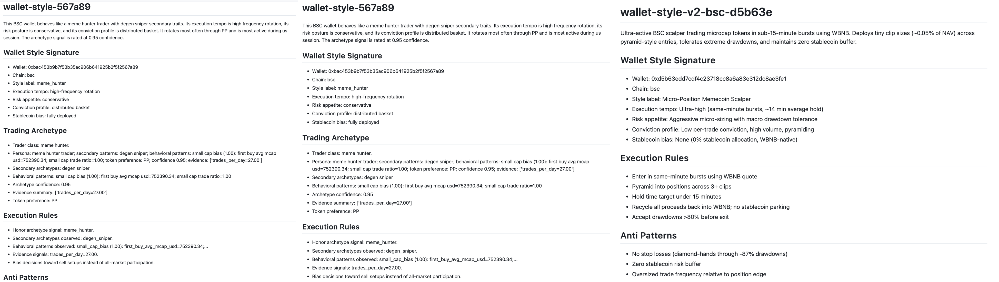
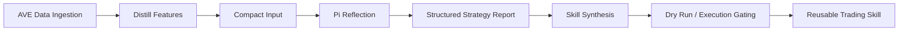

# 0T-Skill V2

> We don't copy trades; we clone the cognitive DNA of the market's elite.



0T-Skill V2 是一套专为链上原生设计的策略蒸馏框架。它利用 Auto Research 机制，从 AVE 的海量原始数据中提取顶级交易员的操盘逻辑，并将其封装为可插拔、可进化的 AI Skills。

它不是一个传统意义上的“跟单系统”。

我们不预测市场，我们只解析那些已经征服了市场的大脑。

## 🌪 核心理念：从数据流水到“交易大师”

在链上博弈中，信号是廉价的，逻辑才是资产。

传统的跟单系统，本质上只是对交易动作做机械复制；而 0T-Skill V2 做的是另一件事：把一位顶级交易员的行为模式、仓位节奏、风险偏好和市场上下文，从原始交易流水里“脱壳”出来，再蒸馏成一个可运行、可审计、可复用的 Skill。

换句话说：

- 我们不关心他单次买了什么，而关心他为什么会在那个时刻买。
- 我们不只看盈利结果，而看盈利背后是否存在可迁移的决策结构。
- 我们不复制动作，而复制思维模型。

通过接入 AVE 提供的全维度资产追踪与历史数据接口，系统会对一个地址进行多层审计：

- 看他买了什么，更看他买入时的市场 Context
- 看他是在抄底，还是在博弈流动性池锁定瞬间
- 看他的仓位节奏、分批方式、风险容忍度与退出习惯

输入的是流水，输出的是灵魂画像。

每一个被蒸馏出的 Skill，都可以被视为一个在特定环境下生存下来的“数字专家”。

例如：

- Meme 爆发期的超短线冲浪者
- 流动性塌陷中的抄底型选手
- 高波动区间里的节奏型做市猎手

这些 Skill 不是静态标签，而是可以被调用、被咨询、被继续组合的策略单元。

## 🧪 技术链路：The Refinement Pipeline

我们把整个处理过程视为一条高精度的炼金链路。每一步，都在提升逻辑的纯度。



当前仓库里的实际主线是：

`wallet -> AVE -> distill_features -> reflection_report -> skill_build -> execution_outcome`

对应实现和文档可以直接看：

- [docs/architecture/01-system-overview.md](./docs/architecture/01-system-overview.md)
- [docs/architecture/02-wallet-style-agent-reflection.md](./docs/architecture/02-wallet-style-agent-reflection.md)
- [docs/README.md](./docs/README.md)

### 1. AVE Data Ingestion · Raw Material

系统深度集成 AVE 数据平面。这不是简单地拉价格，而是把交易发生瞬间的上下文尽可能完整地还原出来。

在当前仓库中，数据面明确是 `AVE-only`，默认通过 `ave_rest` provider 工作。它会围绕目标钱包和目标市场拼装一组足够厚的证据层，包括：

- 钱包历史交易行为
- token 基础画像
- 池子和流动性上下文
- holder 分布与风险快照
- 市场 regime 与 focus token context
- 后续执行阶段需要的 token / market / signal 数据

这里真正重要的点不在于“拿到了多少数据”，而在于 AVE 提供的数据密度，足以让我们从“这个人赚过钱”继续往下追问到“他到底靠什么赚钱”。

相关实现入口：

- [.env.example](./.env.example)
- [../CONFIGURATION.md](../CONFIGURATION.md)
- [skills/ave-data-gateway](./skills/ave-data-gateway)

### 2. Logic Distillation · Core Engine

蒸馏阶段做的不是总结几条交易记录，而是对地址行为做多维拟合。

我们会把原始流水压缩成可解释特征，再从这些特征里提炼出一位交易员稳定重复的行为模式。例如：

- 持仓节奏与平均持有时长
- 胜率、利润因子、回撤容忍度
- 常用 quote token 与偏好交易对
- 分批建仓模式与 sizing pattern
- 风险过滤器与 entry factors
- signal context 与 market context

这一步得到的不是最终结论，而是一份高度压缩但结构清晰的 `compact_input`。它像是一张被整理过的“策略证据板”，会被继续送入反思链审计。

### 3. Pi Reflection · The Auditor

这里是整个系统最关键的一层。

Pi 在这条链路里不是聊天模型，而是策略审计师。它接收：

- `compact_input`
- 固定 schema
- 静态 system instruction
- 临时注入的 memory / review hints / hard constraints

然后输出严格结构化的策略报告：

- `profile`
- `strategy`
- `execution_intent`
- `review`
- `reflection_status`
- `fallback_used`

这个过程的本质，不是让模型“说得像”，而是让模型不断追问：

- 为什么他会在这个流动性枯竭的时刻选择加仓？
- 这是一种可重复的策略，还是样本太小的偶然收益？
- 这个地址依赖的 market context 到底是什么？
- 哪些逻辑可以转译成执行规则，哪些只能保留为低置信度假设？

当前 reflection 使用的是 Pi runtime 驱动的结构化反思链。仓库里保留了完整的 stage 合同与失败回退逻辑：当 reflection 失败时，会触发本地 fallback extractor，但不会改变上下游阶段契约。

相关文档：

- [docs/architecture/02-wallet-style-agent-reflection.md](./docs/architecture/02-wallet-style-agent-reflection.md)

典型产物包括：

- `reflection_job.json`
- `reflection_result.json`
- `reflection_normalized_output.json`
- `summary.json`
- `stage_reflection.json`

### 4. Skill Synthesis · The Artifact

通过审计的策略逻辑，不会停留在一份报告里，而是会被编译成一个标准化 Skill 包。

这一步输出的，是可以被调用、被验证、被继续演化的策略工件，而不是一段概念描述。

一个 Skill 包通常包含：

- `manifest.json`
- `actions.yaml`
- `SKILL.md`
- `agents/interface.yaml`
- `references/style_profile.json`
- `references/strategy_spec.json`
- `references/execution_intent.json`

公开仓里已经保留了一份真实的 wallet-style skill fixture：

- [skills/wallet-style-v2-bsc-d5b63e-5cf11b2a](./skills/wallet-style-v2-bsc-d5b63e-5cf11b2a)

### 5. Execution Gating · Final Constraint

蒸馏出的 Skill 并不会直接变成一个无约束交易机器人。

链路后面仍然有 dry-run / execution gating，用来确认：

- review 状态是否允许继续
- strategy 是否具备可执行边界
- route、slippage、gas、额度等前置条件是否满足
- 最终是否进入 live readiness

这保证了系统输出的是“可以被执行的策略代理”，而不是“会说故事的交易叙事”。

## 🧠 Auto Research：让 AI 成为最严苛的策略审计师

这个过程不是简单的静态分析，而是一个反复迭代的自循环系统。

它的工作方式可以概括为五步：

1. 从 AVE 数据面提取足够密度的行为证据，而不是凭少量样本下结论。
2. 通过蒸馏模块，把地址行为拆成若干可解释特征，例如 tempo、risk appetite、preferred tokens、position sizing、market context。
3. 通过 Pi 反思链，把“像什么样的交易员”转写成“为什么这样交易、在什么边界下有效”。
4. 通过 review、回测和 execution gating，剔除运气成分、样本不足和不可执行的伪策略。
5. 把通过验证的逻辑编译成 Skill，使其进入可复用、可继续进化的形态。

最终，一个地址不再只是地址，而会被转化为一个具备逻辑、概率和风控要求的结构化 Skill。

## 💉 数据注入：数据是怎么进入系统的

数据注入不是一句“我们接了 API”就结束了。当前仓库的实现里，这个过程分成两层。

### 配置层注入

通过环境变量声明数据源、运行时和 workspace：

```bash
AVE_DATA_PROVIDER=ave_rest
AVE_API_KEY=...
AVE_REST_SCRIPT_PATH=vendor/ave_cloud_skill/scripts/ave_data_rest.py
AVE_DATA_SERVICE_URL=http://127.0.0.1:8080
OT_RUNTIME_DEFAULT=pi
OT_DEFAULT_WORKSPACE=.ot-workspace
```

### 运行层注入

AVE 拉回的数据不会被原样丢给模型，而是先进入阶段化处理：

- 原始 wallet / token / market 数据进入预处理
- 预处理结果形成 `distill_features`
- `distill_features` 被继续归并为 `compact_input`
- `compact_input + memory + hints + constraints` 进入 Pi reflection
- reflection 结果再进入 skill build 与 execution outcome

也就是说，AVE 负责把市场的“原矿”送进来，distill 和 reflection 负责把原矿炼成可执行逻辑。

这正是 AVE 在整个系统里的核心意义：

它不是数据装饰层，而是帮助我们真正定位“可迁移交易逻辑”的基础设施。

## 🧬 蒸馏结果：最后到底会得到什么

一个成功蒸馏出来的 Skill，不是抽象概念，而是有明确结构的工件。

下图展示了三个文档 example 的拼接长图：


可以直接查看当前仓库中的真实示例：

- [manifest.json](./skills/wallet-style-v2-bsc-d5b63e-5cf11b2a/manifest.json)
- [style_profile.json](./skills/wallet-style-v2-bsc-d5b63e-5cf11b2a/references/style_profile.json)
- [strategy_spec.json](./skills/wallet-style-v2-bsc-d5b63e-5cf11b2a/references/strategy_spec.json)
- [execution_intent.json](./skills/wallet-style-v2-bsc-d5b63e-5cf11b2a/references/execution_intent.json)

这类结果通常会包含四个核心层：

### 1. Style Profile

描述这位“交易大师”是谁：

- 风格标签
- 交易节奏
- 风险偏好
- 偏好 token
- 持仓与分批特征
- 置信度

### 2. Strategy Spec

描述他在什么条件下会出手：

- entry conditions
- exit conditions
- position sizing
- risk controls
- invalidation rules
- market context

### 3. Execution Intent

描述这套逻辑如果进入执行层，会以什么边界工作：

- adapter
- mode
- route preferences
- preflight checks
- leg count
- max position pct

### 4. Review / Readiness

描述这套逻辑当前是否足够可靠：

- reflection status
- fallback used
- confidence
- review backend
- backtest confidence
- execution readiness

所以蒸馏的结果，不是“这个地址好像挺会做 Meme”，而是：

- 他是什么风格的交易员
- 他在哪类市场环境里最有效
- 他如何进场、如何分批、如何退出
- 他的风险边界和失效条件是什么

## ⚡ 快速开始

### 环境依赖

- Python `3.11+`
- Node.js `20+`
- `npm`
- Rust / Cargo
  - 需要 onchainos 执行路径时使用
- Docker / Compose
  - 仅在需要本地 Postgres / Redis / MinIO 时使用

### 1. 安装依赖

```bash
./scripts/bootstrap.sh
cp .env.example .env
```

`bootstrap.sh` 会自动：

- 创建 `.venv`
- 安装主工程依赖
- 安装 vendored AVE 依赖
- 安装 vendored Pi runtime 依赖
- 构建并校验 `pi-runtime`

### 2. 补齐配置

最少需要：

```bash
AVE_API_KEY=...
API_PLAN=pro
KIMI_API_KEY=...
```

如果你只想先跑蒸馏链，到这里就够了。

如果你还要继续跑 dry-run 或 live execution，再补：

```bash
OKX_API_KEY=...
OKX_SECRET_KEY=...
OKX_PASSPHRASE=...
```

完整配置说明见：

- [../CONFIGURATION.md](../CONFIGURATION.md)

### 3. 启动服务

```bash
./scripts/start_ave_data_service.sh
./scripts/start_pi_runtime.sh
./scripts/start_frontend.sh
```

如果你要起本地基础设施栈：

```bash
OT_START_LOCAL_STACK=1 ./scripts/bootstrap.sh
```

或者手动：

```bash
./scripts/start_stack.sh
```

### 4. 跑一次蒸馏

```bash
ot-enterprise style distill \
  --workspace-dir .ot-workspace \
  --wallet 0x... \
  --chain bsc
```

查看结果：

```bash
ot-enterprise style list --workspace-dir .ot-workspace
ot-enterprise style get --workspace-dir .ot-workspace --job-id <job_id>
ot-enterprise style resume --workspace-dir .ot-workspace --job-id <job_id>
```

如果你想直接看阶段工件，重点关注 `.ot-workspace` 中 job 目录下的：

- `summary.json`
- `stage_distill_features.json`
- `stage_reflection.json`
- `reflection_result.json`
- `stage_build.json`
- `stage_execution.json`

前端默认地址：

- `http://127.0.0.1:8090`

## 🧩 可组合性与未来愿景

0T-Skill 并不是一个孤立的沙盒，它是未来交易智能网络里的组件层。

### Skill 作为策略插件

蒸馏出来的学习成果，不只是给人看的一份分析报告，而是可以继续输出给其他交易 Agent 的结构化策略资产。

这些输出包括：

- strategy weights
- market context assumptions
- risk bounds
- invalidation rules
- execution preferences

这意味着一个外部 Agent 可以把 0T-Skill 的结果当成策略插件来消费，而不是重新从零学习。

### Agent-to-Agent Intelligence

未来版本里，Skill 不只是单兵作战。

我们希望把不同市场周期里蒸馏出的专家 Skill 聚合成一个“专家委员会”。例如：

- 抄底专家
- 趋势专家
- 波段专家
- 流动性陷阱识别专家

当新行情开启时，系统不必只依赖单一视角，而是可以调用多个 Skill 针对同一个 token 进行多维度辩论，最终输出一份拟合后的最优判断。

### Skill 作为可咨询的“交易大师”

这些 Skill 可以被当成特定环境下的交易大师来咨询。

例如，你可以问：

- 基于你的逻辑，现在这个 token 值得入场吗？
- 当前 market regime 还在你的胜率区间里吗？
- 如果要做，这笔交易应该怎么分批、在哪些条件下失效？

它返回的不是一句模糊的“看多”或“看空”，而是带边界、带条件、带风控约束的策略意见。

### Strategy LEGO

我们的长期愿景，是把复杂交易策略拆成基础模块，让开发者可以像搭乐高一样组合 Skill，去适应不断变化的市场。

当新行情开启时，系统自动调用最匹配当前环境的“交易大师”协同决策；当新的信号维度加入时，系统继续更新和重蒸馏已有 Skill，使策略库不断进化。

## 目录概览

- [src/ot_skill_enterprise](./src/ot_skill_enterprise)
  主工程源码与控制平面
- [services](./services)
  本地服务实现
- [skills](./skills)
  公开保留的 skill 包与 fixture
- [docs](./docs)
  工程与产品文档
- [../distill-modules](../distill-modules)
  蒸馏链设计与模块拆分文档

## 进一步阅读

- [docs/README.md](./docs/README.md)
- [docs/architecture/01-system-overview.md](./docs/architecture/01-system-overview.md)
- [docs/architecture/02-wallet-style-agent-reflection.md](./docs/architecture/02-wallet-style-agent-reflection.md)
- [../distill-modules/00-总结指引.md](../distill-modules/00-总结指引.md)

---

交易的未来，不只是信号自动化，而是智力资产化。

当一个交易员的 Skill 被蒸馏出来，它就成了一个可以被学习、被询问、被组合、被继续复刻的数字专家。
