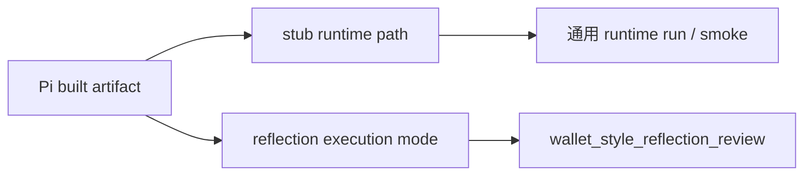

# System Overview

`0t-skill_hackson` 当前是一个 runtime-first 的 SkillOps 平台，目标不是替代 agent，而是把 agent 的执行结果变成可治理、可复用、可晋升的 skill 资产。

## 当前主链

- 通用主链：
  - `run -> evaluation -> candidate -> package -> validate -> promote`
- 钱包风格蒸馏主链：
  - `wallet address -> AVE data -> compact json -> Pi reflection agent -> candidate -> compile -> validate -> promote -> smoke QA`

## 五层结构

### 1. Provider / Skill Substrate

- `services/ave-data-service/`
- `skills/ave-data-gateway/`
- `src/ot_skill_enterprise/providers/`

职责：

- 提供交易历史、代币信息、价格、signals
- 保持稳定输入输出
- 不负责 runtime session、candidate、promotion

### 2. Runtime Adapter Layer

- `src/ot_skill_enterprise/runtime/`
- `vendor/pi_runtime/`

职责：

- 管理 session / invocation
- 拉起 embedded `Pi`
- 把 transcript 翻译成统一 runtime event / artifact

### 3. Reflection Layer

- `src/ot_skill_enterprise/reflection/`
- `src/ot_skill_enterprise/style_distillation/service.py`

职责：

- 把 compact JSON 包装成结构化 reflection job
- 通过 `Pi` reflection execution mode 获取结构化 review
- 在失败时回退到本地 extractor
- 保留 reflection run / session lineage

### 4. SkillOps / QA Layer

- `src/ot_skill_enterprise/runs/`
- `src/ot_skill_enterprise/qa/`
- `src/ot_skill_enterprise/lab/`
- `src/ot_skill_enterprise/skills_compiler/`

职责：

- 记录 run / trace / artifact / evaluation
- 生成 candidate
- 编译 skill package
- validate 和 promote

### 5. Control Plane

- `src/ot_skill_enterprise/control_plane/`
- `src/ot_skill_enterprise/frontend_server.py`
- `frontend/`

职责：

- 暴露 CLI / API / dashboard
- 展示 runtime、candidate、promotion、style distillation、reflection lineage

## Pi 模式说明

- `stub runtime path`
  - 通用 runtime run 和 smoke 仍走这条路径
- `reflection execution mode`
  - 只在明确的 `pi_mode=reflection` 下启用
  - 负责产出结构化 JSON review

## 核心边界

- `Pi` 是项目内 runtime，不是控制面主模型
- reflection run 必须单独记录为 `wallet_style_reflection_review`
- reflection run 不参与 candidate / promote
- `Hermes` 只提供设计参考，不直接运行在当前项目里
