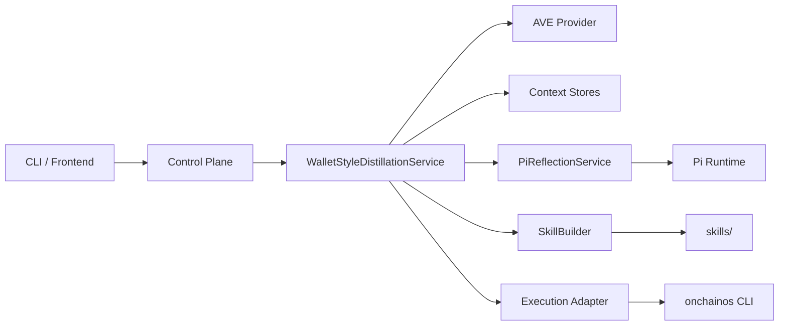

# System Overview

当前系统是一条以 `wallet-style skill` 为核心的 SkillOps 链路。

## 主链

```text
wallet -> AVE -> distill_features -> Pi/Kimi reflection -> skill_build -> execute(dry-run/live)
```

同时保留通用 SkillOps 流程：

```text
run -> evaluation -> candidate -> package -> validate -> promote
```

## 模块视图



## 四个阶段

### 1. `distill_features`

负责：

- AVE 钱包数据拉取
- token enrich
- 市场上下文
- 交易配对与统计
- 信号与风控过滤
- `compact_input` 生成

产物：

- `stage_distill_features.json`

### 2. `reflection_report`

负责：

- Pi/Kimi 结构化反射
- 输出 `profile + strategy + execution_intent + review`
- reflection 失败时触发 fallback extractor

产物：

- `stage_reflection.json`

### 3. `skill_build`

负责：

- backtest
- `confidence / strategy_quality / example_readiness`
- candidate compile / validate / promote
- `primary.py` 和 `execute.py`

产物：

- `stage_build.json`

### 4. `execution_outcome`

负责：

- `prepare_only`
- `dry_run`
- `live`

固定执行路径：

```text
wallet login/status -> wallet addresses/balance -> security -> quote -> approval -> simulate -> broadcast
```

产物：

- `stage_execution.json`

## 上下文层

系统采用 artifact-backed 的分层上下文：

- 静态指令：固定的 stage / reflection 指令
- canonical ledger：job 元信息、stage 状态、lineage
- stage artifacts：四段不可变快照
- ephemeral envelopes：reflection 调用前临时注入的上下文
- derived memory / review hints：可复用短记忆和提示

## 边界

### 数据平面

- 只允许 AVE
- 不从 onchainos 读取市场、PnL、signals 或持仓数据

### 执行平面

- 只允许 onchainos CLI
- 执行必须经过 `execute` action
- 不允许从蒸馏阶段直接链上广播

## 配置原则

外部依赖都走环境变量：

- AVE：`AVE_API_KEY`、`API_PLAN`、`AVE_DATA_PROVIDER`
- Pi/Kimi：`KIMI_API_KEY`、`OT_PI_REFLECTION_MODEL`
- onchainos：`OKX_API_KEY`、`OKX_SECRET_KEY`、`OKX_PASSPHRASE`

CLI 和前端服务会自动加载主工程目录下的 `.env`。
