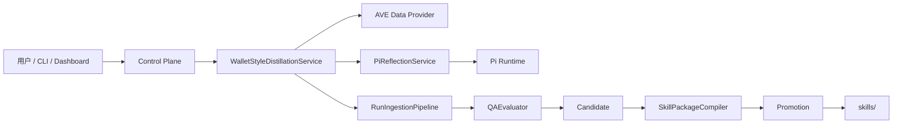
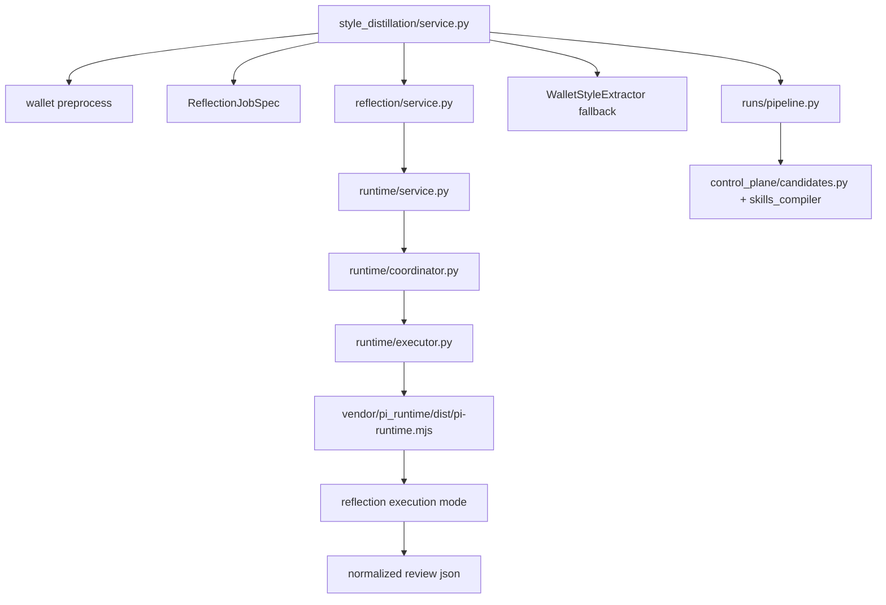
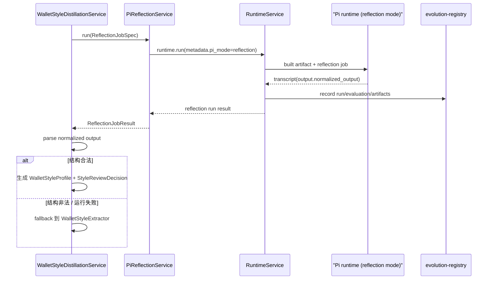
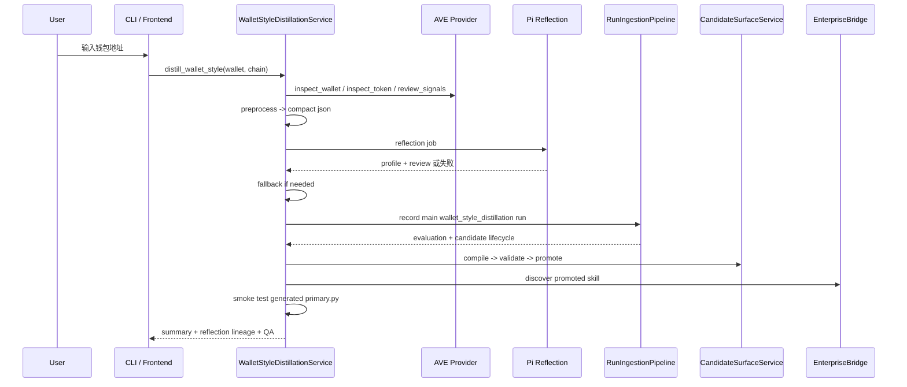

# Wallet Style Agent Reflection

这份文档只讨论一个问题：  
`wallet style distillation` 在升级到 `Pi` 后台 agent 自省器以后，系统现在到底怎么跑。

## 1. 系统上下文图

结论：

- `WalletStyleDistillationService` 是应用化总入口
- `PiReflectionService` 只负责风格提取和 review
- skill candidate 仍然由主 distillation run 生成

## 2. 模块关系图

模块边界：

- `reflection/`
  - 定义 job/result/report 的最小稳定接口
- `runtime/`
  - 负责标准化 session、run、trace、artifact
- `style_distillation/`
  - 负责编排、fallback、candidate、QA 和 summary

## 3. Reflection Sequence

关键约束：

- reflection run 的 `flow_id` 固定为 `wallet_style_reflection_review`
- reflection run 的 `disable_candidate_generation=true`
- reflection lineage 必须回写到 distillation `summary.json`

## 4. End-to-End Distillation Sequence

## 5. 关键文件

- `src/ot_skill_enterprise/reflection/models.py`
- `src/ot_skill_enterprise/reflection/service.py`
- `src/ot_skill_enterprise/style_distillation/service.py`
- `src/ot_skill_enterprise/runtime/coordinator.py`
- `src/ot_skill_enterprise/runs/pipeline.py`
- `vendor/pi_runtime/upstream/coding_agent/src/ot_runtime_entry.ts`
- `vendor/pi_runtime/upstream/coding_agent/src/ot_reflection_mode.ts`

## 6. 数据与产物

一次成功的 wallet style distillation 至少会留下三段 lineage：

1. `wallet_style_reflection_review`
   - `reflection_run_id`
   - `reflection_session_id`
   - `reflection_status`
2. `wallet_style_distillation`
   - 主 candidate 生成 run
3. `promotion`
   - 晋升到 `skills/` 的最终包

job 目录下的关键 artifacts：

- `wallet_profile.preprocessed.json`
- `reflection_job.json`
- `reflection_result.json`
- `reflection_normalized_output.json`
- `style_profile.json`
- `style_review.json`
- `summary.json`

## 7. 当前默认值

- 默认优先走 `Pi` reflection
- `OT_PI_REFLECTION_MOCK=1` 时走 mock reflection，用于测试和离线验证
- reflection 失败时回退到 `WalletStyleExtractor`
- 当前仍是单任务同步闭环，不处理并发
