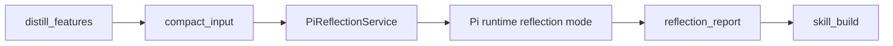
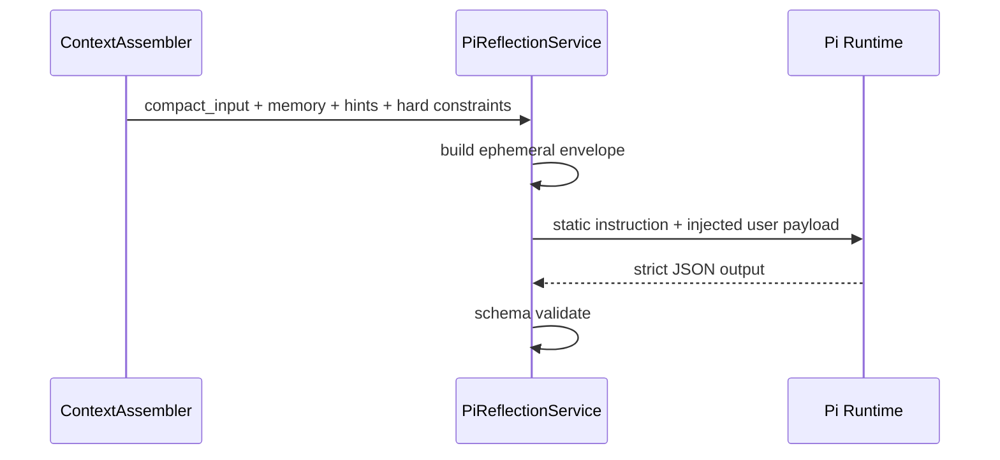

# Wallet Style Agent Reflection

这份文档只说明钱包风格蒸馏链里的 reflection 部分如何工作。

## Reflection 在整条链里的位置

reflection 只负责把 `compact_input` 变成结构化策略报告，不负责编译、晋升或执行。

## 输入和输出

### 输入

- `compact_input`
- 固定 schema
- 静态 system instruction
- 临时注入的 memory / review hints / hard constraints

### 输出

- `profile`
- `strategy`
- `execution_intent`
- `review`
- `reflection_status`
- `fallback_used`

## 上下文处理方式

reflection 使用 Hermes 风格的“静态 + 临时注入”模型：

- system prompt 固定版本化
- 动态事实只进入本次调用的 `user payload`
- memory 和 review hints 都会 fenced，避免回流污染 stage artifact

## 失败与 fallback

reflection 失败有两种结果：

1. `reflection_status = succeeded`
   - 使用 Pi/Kimi 结果
   - `fallback_used = false`
2. `reflection_status = failed`
   - 使用本地 fallback extractor
   - `fallback_used = true`

fallback 只发生在 reflection 内部，不会改变上下游阶段合同。

## 运行记录

每次 reflection 都会写入：

- `reflection_run_id`
- `reflection_session_id`
- `reflection_flow_id = wallet_style_reflection_review`
- `reflection_job.json`
- `reflection_result.json`
- `reflection_normalized_output.json`

这些信息会继续进入 `summary.json` 和 `stage_reflection.json`。

## 约束

- ReflectionAgent 不直接读 `full_activity_history`
- ReflectionAgent 不自己再拉 AVE
- Reflection 成功不等于策略可展示
- `strategy_quality`、`example_readiness`、`execution_readiness` 由后续阶段决定
