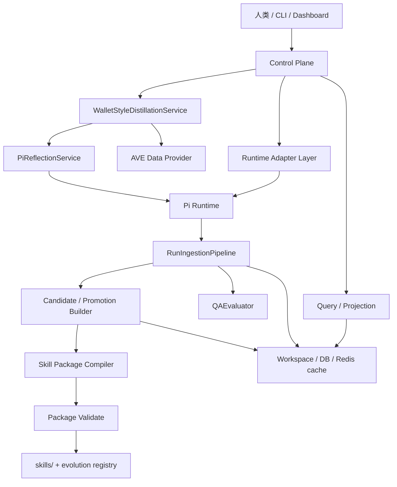
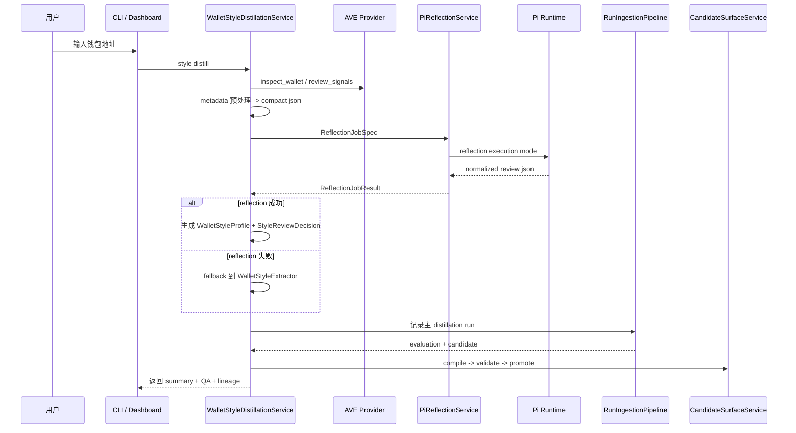

# 0T Skill Hackson 大白话说明

这份文档只回答 5 个问题：

1. 这个项目现在到底能干什么
2. 一次任务到底怎么流转
3. `Pi` 和 `Hermes` 现在分别扮演什么角色
4. 钱包风格蒸馏为什么能产出一个真的 skill
5. 前端和 CLI 看到的数据分别来自哪里

文档只基于当前 `0t-skill_hackson` 代码，不复述旧版本设计。

## 1. 一句话先说清

`0t-skill_hackson` 不是“另一个会替你做所有事的 agent”。

它更像一个 `runtime + SkillOps 控制面`：

- `Pi` 负责执行任务
- `0T` 负责收集 run、trace、artifact
- `0T` 负责做 evaluation
- `0T` 负责在需要时生成 candidate
- `0T` 负责把 candidate 编译成标准 skill 包
- `0T` 负责 validate、promote、discover、smoke test

当前通用主链仍然是：

`run -> evaluation -> candidate -> package -> validate -> promote`

现在新增的一条 hackathon 应用化链路是：

`wallet -> AVE data -> compact json -> Pi reflection -> main distillation run -> candidate -> compile -> validate -> promote -> smoke QA`

## 2. 当前真实架构

大白话理解：

- `Control Plane`
  - 给人、CLI 和前端提供入口
  - 不直接做 LLM 推理
- `Pi Runtime`
  - 项目里的实际 runtime
  - 既能跑默认 stub/smoke 路径，也能跑 reflection 路径
- `PiReflectionService`
  - 专门负责结构化风格提取和自省
  - 只产出 review 结果，不直接生成 skill
- `RunIngestionPipeline`
  - 统一写入 run、trace、artifact、evaluation
- `Evolution + Compiler`
  - 把主 distillation run 变成 candidate 和标准 skill 包

## 3. `Pi` 和 `Hermes` 现在分别是什么

### 3.1 `Pi` 是当前项目里的真实执行底座

当前 `Pi` 有两条执行路径：

- `stub runtime path`
  - 默认的通用 runtime/smoke 路径
  - 适合普通 run、演示和基础闭环验证
- `reflection execution mode`
  - 专门给钱包风格蒸馏使用
  - 会要求输出结构化 JSON，并把结果回写成标准 run/evaluation/artifact

### 3.2 `Hermes` 只是参考对象

当前项目对 `Hermes` 的借鉴点只有机制，不是运行依赖：

- 借鉴了“后台 review / nudge”思路
- 借鉴了“LLM 柔性判断”思路
- 借鉴了“生成后立即进入可用闭环”思路

但当前代码里不会：

- import `hermes-agent_副本`
- shell 调用 `Hermes`
- 把 `Hermes` 当成外部服务接进主链

结论就是：

- `Pi` 是现在真的在跑的 runtime
- `Hermes` 只是设计参考

## 4. 钱包风格蒸馏现在怎么跑

这里有两个很重要的点：

- 反射 run 和主 distillation run 是两条独立 lineage
- 只有主 distillation run 会进入 candidate/promote

也就是说，`Pi` reflection 只负责“看懂这个地址的交易风格”，不会自己直接产 skill。

## 5. 为什么说它不是普通 prompt demo

因为它不是“把地址扔给一个 prompt，然后直接输出一段文本”。

它是一个完整闭环：

1. 从 `AVE` 拉真实或 mock 的钱包/代币/信号数据
2. 把 metadata 压成稳定的 compact JSON
3. 把 compact JSON 送给 `Pi` reflection agent 做结构化提取
4. 生成主 distillation run，并走现有 evaluation/candidate 体系
5. 编译成标准 skill 包
6. validate 后 promote 到本地 `skills/`
7. 做一次 smoke test，确认 skill 能被发现和运行

QA 仍然是这 3 条：

1. 能完整生成一个风格 skill
2. 风格 skill 能被正确自动采用
3. 风格 skill 能被正确运行并有效产出

## 6. 前端和 CLI 看到的是什么

### 6.1 `style distill` 返回的核心字段

- `review_backend`
- `reflection_flow_id`
- `reflection_run_id`
- `reflection_session_id`
- `reflection_status`
- `fallback_used`

它们回答的是：

- 这次风格提取到底是 `Pi reflection` 还是 fallback
- reflection 这条 review lineage 有没有成功落盘
- 最终主 distillation run 用的是哪条 review 结果

### 6.2 Job 目录下会留下哪些关键产物

- `wallet_profile.preprocessed.json`
- `reflection_job.json`
- `reflection_result.json`
- `reflection_normalized_output.json`
- `style_profile.json`
- `style_review.json`
- `summary.json`

大白话看法：

- 想看原始输入，看 `wallet_profile.preprocessed.json`
- 想看 reflection 请求和返回，看 `reflection_*.json`
- 想看最终被 skill 编译消费的结构化结果，看 `style_profile.json` 和 `style_review.json`
- 想看这次任务最后是否通过 QA，看 `summary.json`

## 7. 当前默认值和边界

- 默认优先走 `Pi reflection`
- `OT_PI_REFLECTION_MOCK=1` 时会走 mock reflection，主要用于测试和离线演示
- reflection 失败、超时或 schema 非法时，会自动回退到 `WalletStyleExtractor`
- 当前只做单任务同步闭环，不处理并发
- 当前通用化接口已经抽成 `reflection/` 子系统，但正式业务范围先只覆盖 `wallet style distillation`
