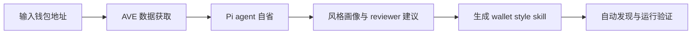
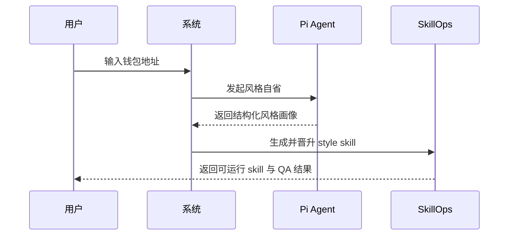

# 黑客松路演版：钱包地址蒸馏成交易风格 Skill

这份文档面向黑客松评委，不展开底层实现细节，只强调问题、方案、闭环和演示路径。

## 1. 问题

链上地址会留下非常鲜明的交易风格，但这些风格通常只存在于原始交易记录里：

- 有些地址偏高频试错
- 有些地址偏稳健轮动
- 有些地址只打特定题材
- 有些地址会在极少数标的上高集中下注

传统做法通常停在“分析一个地址”，不能把这种风格沉淀成一个可复用、可运行、可自动发现的能力模块。

我们的目标是：

把“一个地址的交易风格”蒸馏成一个真正的 skill。

## 2. 方案

我们把 `0t-skill_hackson` 现有的 `Pi runtime + SkillOps` 闭环，升级成一条应用化路径：

`钱包地址 -> 数据提取 -> Pi agent 自省 -> 风格画像 -> 生成 style skill -> 自动 adopt -> 运行验证`

这里最关键的不是多做一个 prompt，而是把风格提取接进现有的标准闭环里：

- 有独立的 review lineage
- 有结构化画像
- 有 candidate 生成
- 有 compile / validate / promote
- 有 smoke QA

## 3. 闭环

这个系统已经不是“分析完就结束”，而是完整闭环：

1. 用户输入一个地址
2. 系统获取交易历史、代币信息和价格信号
3. `Pi` 后台 agent 输出结构化风格判断
4. 主流程生成一个模仿该地址交易风格的 skill
5. skill 被编译、校验并晋升到本地 `skills/`
6. 系统自动做一次 runtime smoke test，验证这个 skill 能被采用和运行

QA 判断标准固定为：

- 能完整生成一个风格 skill
- 风格 skill 能被正确自动采用
- 风格 skill 能被正确运行和有效产出

## 4. Demo 路径

建议路演时按下面顺序演示：

1. 在 dashboard 或 CLI 输入一个钱包地址
2. 展示系统正在做 `Pi reflection review`
3. 展示生成出的 `style profile` 和 reviewer summary
4. 展示 candidate 被编译并 promote 成 skill
5. 展示 skill 在本地被自动发现
6. 展示 smoke test 或一次 runtime 运行结果

## 5. 创新点

- 不是只做链上分析，而是把分析结果转成真正可运行的 skill
- 不是单次 prompt 输出，而是接入 `run -> evaluation -> candidate -> promote` 工程闭环
- 把 `Pi` 变成后台自省器，让风格提取具备结构化、可追踪、可回放的 lineage
- 保留 fallback 机制，在 reflection 异常时仍能稳定交付 MVP

## 6. 为什么不是普通 prompt demo

普通 prompt demo 的问题是：

- 输出不可追踪
- 结果不稳定
- 不能复用
- 不能进入系统运行时

我们的方案和它的区别在于：

- 有真实 runtime 执行
- 有独立 reflection run 和主 distillation run
- 有标准 skill package 输出
- 有自动 adopt 和 smoke QA
- 有前端和 CLI 都能看到的 lineage 与结果摘要

所以这更像一个“会自我沉淀能力的 SkillOps 系统”，而不是一次性的回答器。

## 7. 后续演进

- 把钱包风格蒸馏扩展到更多链和更多交易模式
- 把 `reflection` 子系统泛化到更多类型的 skill 生成任务
- 把当前单轮自省升级为多轮 review / patch 闭环
- 在保持工程可靠性的前提下，再逐步加入并发和后台调度
