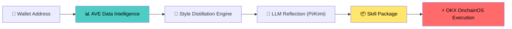
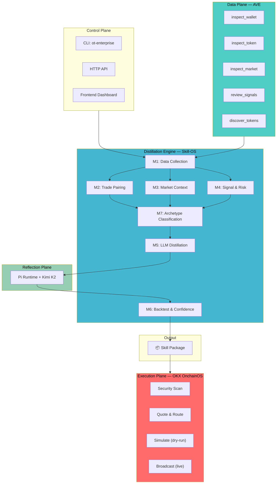
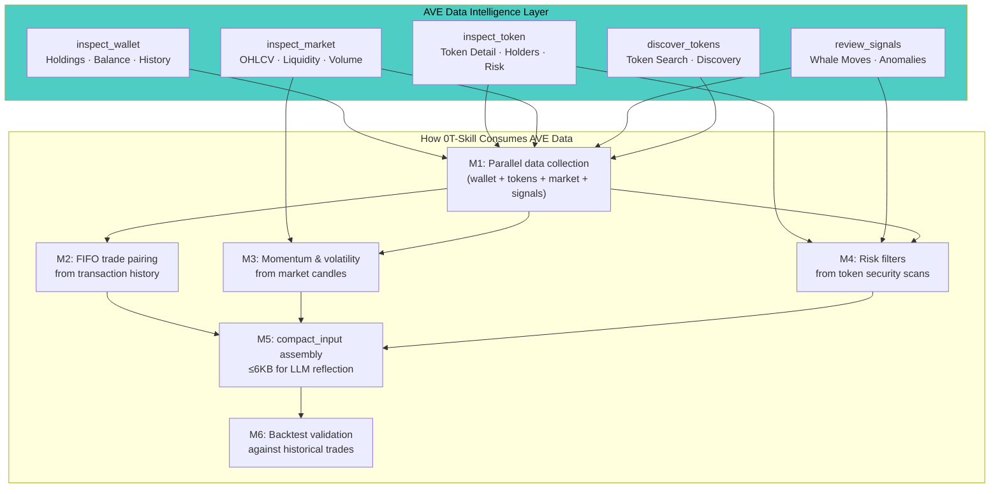

# 0T-Skill — On-chain Wallet Style Distillation & Autonomous Execution

> **Input any wallet address → Distill trading style via AVE → Compile into executable Skill → Execute trades through OKX OnchainOS**

## What is 0T-Skill?

0T-Skill is an end-to-end on-chain trading strategy distillation system. It transforms any wallet's historical trading behavior into a structured, executable **Skill** — powered by **AVE** for data intelligence and **OKX OnchainOS** for on-chain execution.



## Core Architecture



## How AVE Powers 0T-Skill

**AVE is the exclusive data source** for the entire distillation pipeline. Every piece of on-chain intelligence flows through AVE's skill endpoints:



**AVE Skills used in this project:**

| AVE Skill Endpoint | Purpose in 0T-Skill | Consumption Stage |
|---|---|---|
| `inspect_wallet` | Wallet profile, holdings, full transaction history | M1 Data Collection |
| `inspect_token` | Token details, holder distribution, smart contract risk scan | M1 → M4 Risk Filter |
| `inspect_market` | K-line data, liquidity depth, trading volume | M1 → M3 Market Context |
| `review_signals` | On-chain anomaly signals, whale tracking | M1 → M4 Signal Filter |
| `discover_tokens` | Token resolution and discovery | M1 Auxiliary |

## Quick Start

```bash
cd 0t-skill_hackson_v2ing
./scripts/bootstrap.sh
cp .env.example .env
# Fill in AVE_API_KEY, KIMI_API_KEY, and optionally OKX credentials
```

```bash
# Start services
./scripts/start_ave_data_service.sh
./scripts/start_frontend.sh

# Distill a wallet style
ot-enterprise style distill --workspace-dir .ot-workspace --wallet 0x... --chain bsc

# Resume with live execution
ot-enterprise style resume --workspace-dir .ot-workspace --job-id <id> --live-execute --approval-granted
```

## Example Distilled Skills

This repository includes real distilled Skill packages demonstrating the system's output:

### Skill 1: Meme Hunter (0.95 confidence)

- **Wallet**: `0xbac453...567a89` on BSC
- **Archetype**: `meme_hunter` with `degen_sniper` secondary traits
- **Behavior**: High-frequency rotation, 27 trades/day, small-cap bias ($752K avg market cap)
- **Token preference**: PP
- **Confidence**: 0.95 (high)

### Skill 2: Exploratory Profile (0.39 confidence)

- **Wallet**: `0x9998c3...bc0bc2d` on BSC
- **Archetype**: `no_stable_archetype` (insufficient pattern signal)
- **Behavior**: High-frequency rotation, 3.44 trades/day, conservative risk
- **Token preference**: GENIUS
- **Confidence**: 0.39 (low — system honestly reports uncertainty)

### Skill 3: V2 Pipeline Output

- **Wallet**: `0xd5b63e...` on BSC
- **Type**: Full v2 pipeline with enhanced archetype classification

## Repository Structure

```
0t-skill-hackson-public/
├── README.md                                    # This file
├── CONFIGURATION.md                             # Environment setup guide
├── docs/
│   ├── PROJECT_INTRODUCTION.md                  # Detailed project introduction
│   ├── ARCHITECTURE.md                          # Agent framework & system architecture
│   ├── INTEGRATION.md                           # Skill-OS framework integration
│   └── AVE_SKILLS.md                            # AVE Skills documentation (hackathon)
├── distill-modules/                             # Distillation module design docs (M1-M7)
├── 0t-skill_hackson_v2ing/                      # Main project
│   ├── src/ot_skill_enterprise/                 # Core business logic
│   │   ├── style_distillation/                  # Distillation engine + archetype
│   │   ├── reflection/                          # LLM reflection service
│   │   ├── skills_compiler/                     # Skill package compiler
│   │   ├── execution/                           # OKX OnchainOS adapter
│   │   └── providers/ave/                       # AVE data adapter
│   ├── services/ave-data-service/               # AVE REST service
│   ├── skills/                                  # Distilled skill packages
│   ├── vendor/                                  # Vendored dependencies
│   ├── tests/                                   # Test suite
│   ├── scripts/                                 # Bootstrap & startup scripts
│   └── frontend/                                # Dashboard UI
└── agent.md                                     # Agent collaboration rules
```

## Documentation

| Document | Content |
|---|---|
| **[AVE Skills Documentation](docs/AVE_SKILLS.md)** | How AVE Skills power 0T-Skill (hackathon submission) |
| [Project Introduction](docs/PROJECT_INTRODUCTION.md) | Background, core flow, example Skill walkthrough |
| [System Architecture](docs/ARCHITECTURE.md) | Agent framework, 4-stage pipeline, archetype system |
| [Integration Guide](docs/INTEGRATION.md) | AVE + OKX OnchainOS + Skill-OS collaboration |
| [Configuration](CONFIGURATION.md) | Environment variables & dependency setup |

## Tech Stack

| Layer | Technology | Role |
|---|---|---|
| Data Plane | **AVE REST API** | Wallet, token, market, signal data |
| Reflection | Pi Runtime + Kimi K2 | Structured LLM reasoning |
| Compilation | Skill-OS Compiler | Skill package generation & validation |
| Execution | **OKX OnchainOS CLI** | On-chain trade simulation & broadcast |
| Control | Python CLI + HTTP API | Unified entry point & orchestration |
| Frontend | Native HTML/CSS/JS | Runtime status & Skill browsing dashboard |

## License

Apache License 2.0
