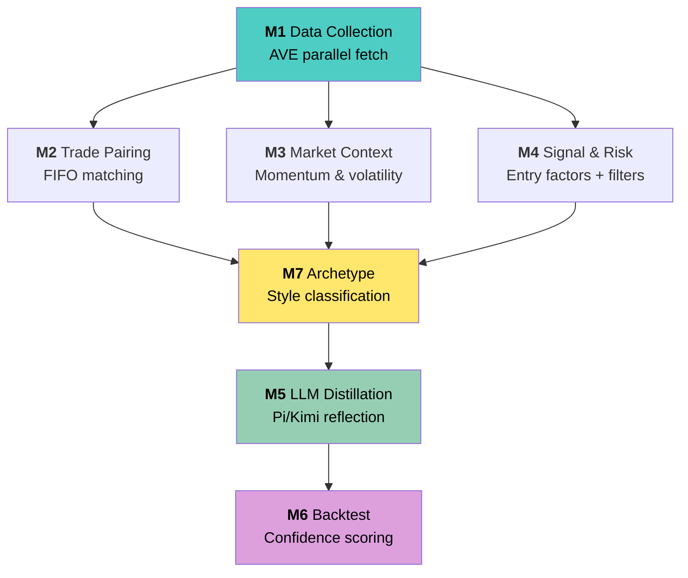
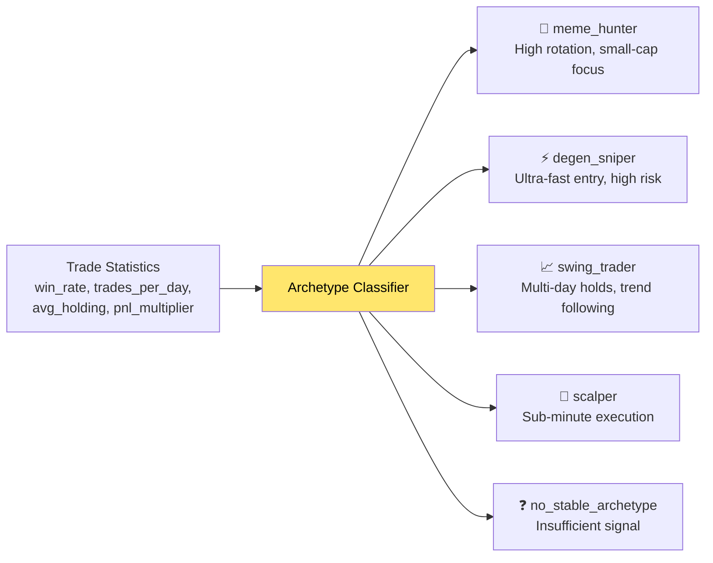
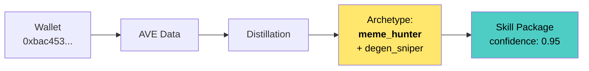
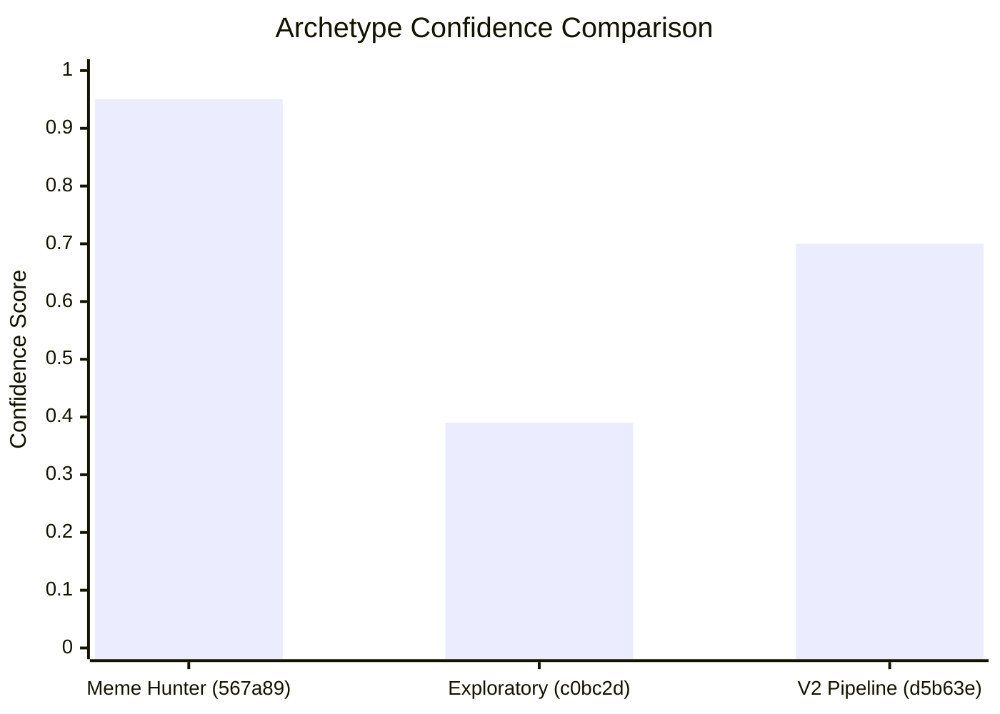
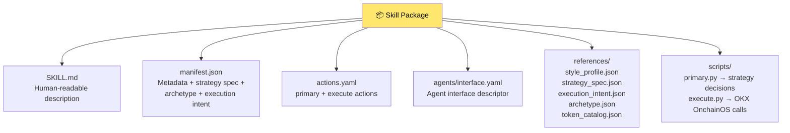

# 0T-Skill Project Introduction

## Background

On-chain wallets exhibit distinct trading styles — some are high-frequency memecoin scalpers, others are patient value holders, and some are degen snipers chasing micro-cap launches. These behavioral patterns encode valuable strategy intelligence, but no systematic tool exists to extract, structure, and operationalize them.

**0T-Skill** solves this: **Input any wallet address → automatically distill its trading style into a structured, executable Skill → execute real trades through OKX OnchainOS.**

## End-to-End Flow

```mermaid
flowchart TD
    INPUT["👤 User inputs wallet address + chain"]
    
    subgraph PHASE1["Phase 1: Data Collection (AVE)"]
        IW["inspect_wallet<br/>→ Holdings, balance, tx history"]
        IT["inspect_token × N<br/>→ Token details, risk scan"]
        IM["inspect_market × N<br/>→ K-lines, liquidity"]
        RS["review_signals<br/>→ On-chain anomalies"]
    end

    subgraph PHASE2["Phase 2: Feature Engineering"]
        M2["Trade Pairing (FIFO)<br/>→ Win rate, P&L ratio"]
        M3["Market Context<br/>→ Momentum, volatility"]
        M4["Risk Filters<br/>→ Contract risks, entry factors"]
        M7["Archetype Classification<br/>→ meme_hunter, degen_sniper..."]
    end

    subgraph PHASE3["Phase 3: LLM Distillation"]
        CI["compact_input ≤6KB"]
        REF["Pi/Kimi Structured Reflection"]
        OUT["profile + strategy +<br/>execution_intent + review"]
    end

    subgraph PHASE4["Phase 4: Build & Verify"]
        BT["Backtest (signal replay)"]
        SC["Confidence Score"]
        PKG["Skill Package Compilation"]
        VAL["Contract Validation"]
        PRO["Promote to Registry"]
    end

    subgraph PHASE5["Phase 5: Execution (OKX OnchainOS)"]
        PRE["Preflight: login + security"]
        DRY["dry-run: simulate"]
        LIVE["live: broadcast"]
    end

    INPUT --> PHASE1
    PHASE1 --> PHASE2
    PHASE2 --> PHASE3
    PHASE3 --> PHASE4
    PHASE4 --> PHASE5

    style PHASE1 fill:#4ECDC4,color:#000
    style PHASE3 fill:#96CEB4,color:#000
    style PHASE5 fill:#FF6B6B,color:#000
```

## Seven-Module Distillation Pipeline

| Module | Responsibility | Input Source |
|---|---|---|
| **M1** Data Collection | Parallel fetch of wallet, tokens, market, signals | AVE API |
| **M2** Trade Pairing | FIFO buy/sell matching → win rate, P&L ratio, holding period | M1 tx history |
| **M3** Market Context | BTC/ETH macro state, focus token momentum & volatility | AVE market data |
| **M4** Signal & Risk | Entry factor frequency analysis, contract risk filtering | M1 + M2 stats |
| **M7** Archetype | Classify wallet into trading archetypes (meme_hunter, degen_sniper...) | M2 + M3 + M4 |
| **M5** LLM Distillation | Structured reflection → profile + strategy + execution_intent | M1-M4 + M7 compact_input |
| **M6** Backtest | Signal replay validation, multi-dimensional confidence score | M2 trades + M3 context |

## Archetype System (M7)

The archetype classifier is a key innovation in the latest iteration. It goes beyond simple statistics to identify **behavioral trading patterns**:

**Behavioral patterns detected:**
- `small_cap_bias` — Preference for tokens with market cap < $10M
- `pyramid_accumulation` — Progressive position building
- `diamond_hands` — Tolerance for extreme drawdowns
- `burst_execution` — Same-minute trade clustering

## Example Skill Walkthrough

### Example 1: Meme Hunter — High Confidence (0.95)

**Source wallet**: `0xbac453b9b7f53b35ac906b641925b2f5f2567a89` on BSC

| Dimension | Distilled Output |
|---|---|
| Primary archetype | `meme_hunter` |
| Secondary | `degen_sniper` |
| Execution tempo | High-frequency rotation (27 trades/day) |
| Behavioral patterns | `small_cap_bias` (1.00) — avg first-buy mcap $752K |
| Risk posture | Conservative with distributed basket |
| Token preference | PP |
| Active windows | US session |
| Anti-patterns | PP can restrict transfers; multiple holder concentration warnings |

### Example 2: Exploratory Profile — Low Confidence (0.39)

**Source wallet**: `0x9998c32dc444709f7b613aa05666325edbc0bc2d` on BSC

| Dimension | Distilled Output |
|---|---|
| Primary archetype | `no_stable_archetype` |
| Secondary | `asymmetric_bettor` (detected but insufficient evidence) |
| Execution tempo | High-frequency rotation (3.44 trades/day) |
| Token preference | GENIUS |
| Confidence | 0.39 (system honestly reports uncertainty) |

This example demonstrates the system's **epistemic honesty** — when the data doesn't support a confident archetype classification, the system reports `no_stable_archetype` rather than forcing a label.

### Example 3: V2 Full Pipeline

**Source wallet**: `0xd5b63e...` on BSC

This skill package was generated through the complete v2 pipeline including archetype classification, enhanced reflection prompts, and full backtest validation.

### Comparison Across Examples

## Skill Package Structure

Every distilled skill produces a standardized package:

## Disclaimer

Distilled strategy Skills are for technical demonstration and research purposes only. They do not constitute investment advice. Live execution requires thorough testing and manual review. On-chain trading carries smart contract risk, liquidity risk, and MEV risk.
