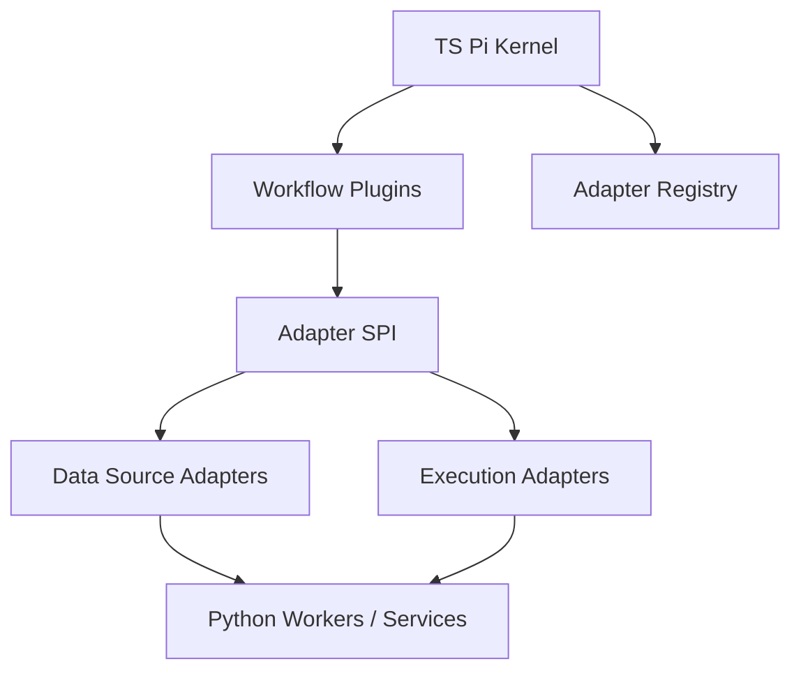

# 下一代架构：数据源与执行适配器

## 文档目标

本文定义下一代架构中的 `Data Source Adapter` 与 `Execution Adapter` 设计，目标是替代当前“数据几乎只认 AVE、执行几乎只认 OKX OnchainOS”的强耦合状态。

本文只讨论适配器层，不展开 `plugin / workflow` 运行时。对应工作流模型见 [plugin-workflow-model.md](./plugin-workflow-model.md)。

## 决策摘要

下一代架构采用以下原则：

- `TS Pi kernel` 负责调度，不直接耦合具体数据源或执行平台
- `workflow plugins` 只声明自己需要哪些能力，不声明自己必须绑定哪一家供应商
- `data source` 与 `execution` 都通过一等 adapter SPI 接入
- 第一阶段允许 adapter 的具体实现仍在 Python 中，只要对外契约稳定

一句话定义：

> 数据源与执行层都必须成为可插拔适配器；插件只依赖能力合同，不依赖 AVE 或 OKX 品牌名。

## 需要解决的核心问题

当前系统的主要结构性问题有三个：

1. 钱包蒸馏默认强依赖 AVE，导致替换数据源时会波及上游 workflow。
2. 执行层默认强依赖 OKX OnchainOS，且部分执行代码还会反向读取数据源能力，边界不清。
3. `distillation / benchmark / execution` 这几类流程没有统一声明自己需要的能力，只能靠隐式依赖和环境变量推进。

下一代设计必须改成：

- 插件依赖“能力”
- adapter 实现“能力”
- kernel 装配插件与 adapter

## 架构分层



## 关键设计原则

### 1. 数据与执行分别建模

不能用一个“大 provider 抽象”混掉两类问题。

必须分开：

- `DataSourceAdapter`
  - 提供市场、钱包、交易、上下文、价格等只读或分析类能力
- `ExecutionAdapter`
  - 提供账户、报价、授权、模拟、广播、订单状态等执行类能力

### 2. 执行适配器不得偷偷承担数据适配器职责

执行层经常需要价格、token、route、risk hints，但这些不代表执行器应该自己去抓所有市场数据。

正确方式是：

- workflow 或 plugin 显式声明需要哪些数据能力
- kernel 提前装配相应 `DataSourceAdapter`
- `ExecutionAdapter` 只接收必要的执行上下文，不反向侵入数据平面

### 3. 技术独立与业务组合继续分离

适配器层也要区分两件事：

- `技术独立`
  - AVE、未来新数据源、OKX、未来其他执行器都应独立开发和发布
- `业务组合`
  - 某个 workflow 仍然可以同时调用一个数据源适配器和一个执行适配器

例如：

- `distillation plugin` 业务上需要钱包交易 + 市场上下文
- 它技术上只依赖 `DataSourceAdapter` 合同，不依赖 AVE

## DataSourceAdapter 目标模型

### 职责

提供 workflow 所需的只读与分析型数据能力，包括但不限于：

- 钱包概览
- 历史交易
- token 元数据
- 价格 / kline / liquidity
- 市场上下文
- 信号、标签、事件流
- 研究和 benchmark 所需参考数据

### 最小能力合同

建议按能力拆而不是按供应商拆。

```ts
interface DataSourceAdapter {
  adapterId: string
  adapterVersion: string
  capabilities(): DataSourceCapabilities
  getWalletProfile(input: WalletProfileInput): Promise<WalletProfile>
  getWalletTrades(input: WalletTradesInput): Promise<WalletTradeSet>
  getTokenMetadata(input: TokenMetadataInput): Promise<TokenMetadataSet>
  getMarketContext(input: MarketContextInput): Promise<MarketContextBundle>
  getResearchDataset(input: ResearchDatasetInput): Promise<ResearchDatasetBundle>
}
```

### 推荐能力切片

建议注册能力时明确切片：

- `wallet_profile`
- `wallet_trades`
- `token_metadata`
- `market_context`
- `price_reference`
- `research_dataset`
- `signal_context`

好处是：

- 同一个 adapter 不必一次实现所有能力
- kernel 可以按 workflow 需要装配多个 adapter

### 标准化产物

不同供应商返回结构不同，因此必须先归一化到统一 artifact：

- `WalletProfile`
- `WalletTrade`
- `TokenMetadata`
- `MarketContextBundle`
- `ResearchDatasetBundle`

这些统一模型由 kernel 或 shared schema 持有，adapter 只能填充，不得自行扩散未受控字段。

## ExecutionAdapter 目标模型

### 职责

提供交易执行相关能力，包括：

- 账户状态
- 地址 / 余额
- quote
- approval / allowance
- simulate
- broadcast
- execution status

### 最小能力合同

```ts
interface ExecutionAdapter {
  adapterId: string
  adapterVersion: string
  capabilities(): ExecutionCapabilities
  getAccountState(input: AccountStateInput): Promise<AccountState>
  getQuote(input: QuoteInput): Promise<QuoteBundle>
  prepareApproval(input: ApprovalInput): Promise<ApprovalPlan>
  simulate(input: SimulationInput): Promise<SimulationResult>
  broadcast(input: BroadcastInput): Promise<BroadcastResult>
  getExecutionStatus(input: ExecutionStatusInput): Promise<ExecutionStatus>
}
```

### 推荐能力切片

- `account_state`
- `quote`
- `approval`
- `simulation`
- `broadcast`
- `execution_status`

### 严格边界

执行适配器不应负责：

- 钱包历史研究数据
- 市场标签与风格研究
- 用于 distillation 的行为样本

如果执行需要额外上下文，应通过显式输入注入：

- `price_reference`
- `token_risk_hints`
- `route_constraints`
- `execution_policy`

## Adapter Registry 设计

`TS Pi kernel` 需要持有统一 registry，用来发现和装配 adapter。

### Registry 负责

- 注册 adapter manifest
- 声明 adapter capabilities
- 处理 workspace 级默认选择
- 检查 workflow 所需能力是否满足
- 根据环境和策略完成 adapter resolution

### Registry 不负责

- 直接执行供应商业务逻辑
- 直接持有供应商私有状态机

建议的 manifest 字段：

- `adapter_id`
- `adapter_type`
  - `data_source` 或 `execution`
- `adapter_version`
- `capabilities`
- `supported_chains`
- `auth_mode`
- `runtime_mode`
  - `ts-native` / `python-worker` / `remote-service`
- `workspace_constraints`

## 推荐实现模式

### 目标模式

- `TS Pi kernel`
  - 负责 registry、resolution、workflow wiring
- `Python workers`
  - 负责第一代 adapter 的具体实现

这意味着：

- 接口定义在 TS kernel 侧
- 当前已存在的大量 Python 业务逻辑先不丢
- 用 RPC / subprocess / service bridge 方式接入 Python adapter 实现

### 第一阶段建议的适配实现

数据源：

- `ave_wallet_data`
  - 从现有 AVE 能力抽出为 `DataSourceAdapter`

执行：

- `okx_onchainos_execution`
  - 从现有 onchainos CLI 抽出为 `ExecutionAdapter`

注意：

- 这一步不是要新增供应商
- 是先把现有强耦合实现收编进统一 adapter 模型

## 与插件的关系

### Distillation Plugin

依赖：

- `wallet_profile`
- `wallet_trades`
- `token_metadata`
- `market_context`

不应依赖：

- execution adapter

### Benchmark Plugin

依赖：

- `research_dataset`
- `market_context`
- 可选 `simulation`

说明：

- benchmark 可以需要模拟或 paper execution
- 但不应直接耦合 live broadcast

### Review Plugin

依赖：

- baseline artifact
- candidate artifact
- benchmark artifact
- 可选 `market_context`

说明：

- review 的核心输入应该是 artifacts，而不是直接访问供应商私有接口

### Live Execution Workflow

依赖：

- execution adapter
- 可选 data adapter 提供前置 context

说明：

- live execution 不是 distillation 或 autoresearch 的默认下游
- 必须经过显式 approval 和 execution workflow

## 推荐工程拆分

### 小组 A：Adapter Contract 组

负责：

- `DataSourceAdapter` 与 `ExecutionAdapter` SPI 定义
- shared schema
- adapter manifest 规范

交付物：

- adapter interfaces
- normalized artifact schema
- registry resolution policy

### 小组 B：AVE Adapter 组

负责：

- 把现有 AVE 逻辑包装为 `DataSourceAdapter`
- 对齐 wallet / token / market / research 能力切片

交付物：

- `ave_wallet_data` adapter
- AVE normalization layer

### 小组 C：OKX / OnchainOS Adapter 组

负责：

- 把现有 onchainos CLI 执行逻辑包装为 `ExecutionAdapter`
- 清理执行侧对数据侧的隐式读取

交付物：

- `okx_onchainos_execution` adapter
- execution context injection 方案

### 小组 D：Kernel Integration 组

负责：

- registry
- workspace-level adapter selection
- workflow 侧 resolution
- adapter health / capability checks

交付物：

- adapter registry runtime
- capability-based resolution

### 小组 E：Python Worker Bridge 组

负责：

- TS kernel 与 Python adapters 的桥接
- RPC / subprocess / local service contract
- 错误映射、超时、重试

交付物：

- python worker bridge
- adapter invocation runtime

## 迁移路线

### Phase 1：先做抽象收编

目标：

- 把现有 AVE 和 OKX 逻辑纳入 adapter SPI

必须完成：

- data / execution SPI
- `ave_wallet_data` adapter
- `okx_onchainos_execution` adapter
- kernel registry v1

### Phase 2：解除隐式耦合

目标：

- execution 不再直接回读数据源
- distillation / benchmark / review 改按能力声明依赖

必须完成：

- capability injection
- normalized artifacts
- workflow resolution policy

### Phase 3：支持替换和并存

目标：

- 新数据源和新执行器可以并存接入
- workspace 可以按策略或场景切换 adapter

必须完成：

- adapter versioning
- adapter fallback policy
- 多 adapter 共存测试

## 关键风险与解决方案

### 风险 1：继续把 adapter 做成供应商分层，而不是能力分层

问题：

- workflow 最终还是会写死 AVE / OKX

解决：

- 先定义能力，再映射供应商
- workflow 只声明能力，不声明品牌

### 风险 2：执行侧仍然偷偷依赖数据侧

问题：

- 表面上模块化，实际上边界还是脏的

解决：

- 执行上下文必须显式注入
- adapter contract 中禁止隐式市场抓取

### 风险 3：TS kernel 和 Python worker 产生双重逻辑源

问题：

- 同一业务逻辑在两边都实现一遍，后期不可维护

解决：

- kernel 只做 orchestration 和 contract
- 领域实现先集中在 Python worker
- 迁移 TS 时按能力逐项替换，不并行复制

### 风险 4：一次性大重构阻塞业务

问题：

- 现有 distill / execution 链全被拖住

解决：

- 先做 adapter facade
- 让现有逻辑在 adapter 背后继续工作
- 等 workflow 和 registry 稳定后再逐步替换内部实现

## 验收标准

满足以下条件时，说明适配器层成立：

1. `distillation plugin` 可以在不修改业务代码的前提下，从 AVE 切到另一个兼容数据源。
2. `execution workflow` 可以在不改 distillation / autoresearch 逻辑的前提下，从 OKX 执行器切到另一个执行器。
3. benchmark 和 review 主要消费标准化 artifact，而不是供应商私有返回。
4. workflow 只声明能力需求，adapter registry 负责装配具体实现。
5. 现有 Python 逻辑可以继续作为第一代 adapter 实现被调用，不要求一次性重写。
