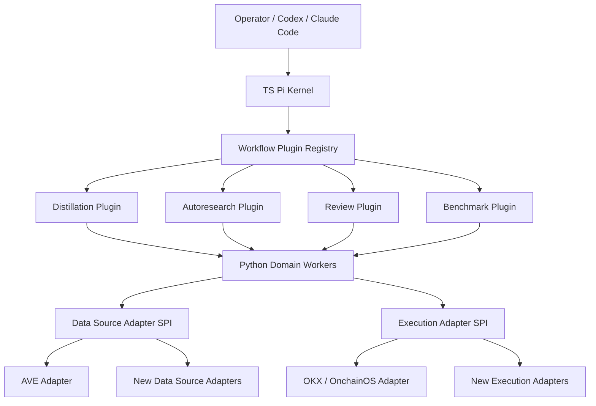
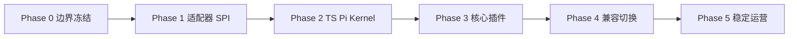

# 下一阶段架构迁移分期

本文只覆盖迁移与交付视角，不重复展开现有产品说明。目标是把当前的 **`Python 主系统 + TS 子运行时`** 逐步迁移到 **`TS Pi 内核 + Python 领域 worker`**，同时把 `distillation`、`autoresearch`、`review`、`benchmark` 统一收敛为可编排插件，把数据源与执行层改成可插拔适配器。

配套的团队并行执行方案见：[team-delivery-plan.md](./team-delivery-plan.md)。

## 1. 迁移目标

### 1.1 目标架构



### 1.2 关键原则

- `Pi` 是智能体内核与插件承载层，不直接承担所有领域逻辑。
- `Python` 保留为领域 worker 层，优先复用现有蒸馏、编译、执行、存储能力。
- `distillation`、`autoresearch`、`review`、`benchmark` 在技术上独立成插件，在业务上允许按工作流组合调用。
- `autoresearch` 不单独闭环，必须能联合 `review + benchmark` 形成“生成 -> 对标 -> 复查 -> 再生成”的循环。
- 数据源和执行层都必须经过稳定的适配器接口，不允许插件直接绑死 AVE 或 OKX。
- 迁移期间保持现有仓库可运行，不允许一次性大重写导致主链失稳。

### 1.3 非目标

- 本轮不追求把所有 Python 逻辑重写为 TS。
- 本轮不追求立即支持所有未来数据源或执行平台。
- 本轮不把 live execution 放进无人值守自动闭环。
- 本轮不要求一次切掉现有 `0t` 控制面。

## 2. 现状与迁移动机

### 2.1 当前状态

- `TS Pi runtime` 已存在，但主要被当作 Python 控制面的嵌入式反射运行时使用。
- 蒸馏主链对 AVE 数据平面和 OKX/OnchainOS 执行平面存在强业务耦合。
- `provider` 与 `execution` 抽象尚未形成真正可替换的稳定边界。
- `0t team` 已经证明仓库具备 workflow / protocol / 多 agent 编排基础。

### 2.2 当前问题

- `Pi` 不是系统第一核心，导致插件化和多 agent 编排的扩展性不足。
- `distillation`、`autoresearch`、`review`、`benchmark` 还没有统一的工作流插件协议。
- 数据源和执行层更像业务实现，不像平台能力。
- 未来更换数据源或执行层时，影响面会穿透到业务主链、测试与产物生成逻辑。

## 3. 迁移后的核心边界

### 3.1 TS Pi Kernel 负责什么

- session lifecycle
- agent / team orchestration
- workflow plugin registry
- plugin loading / plugin dispatch
- tool bridge / event bus / work item 调度
- 统一的 workflow state 与审计日志

### 3.2 Python Domain Workers 负责什么

- 钱包蒸馏与特征提取
- 反射前后结构化数据准备
- skill build / compile / validate
- benchmark 执行与结果生成
- review 所需的辅助分析
- 数据源与执行适配器的具体落地

### 3.3 Workflow Plugins 负责什么

- `distillation`
  - 定义蒸馏输入、阶段输出、蒸馏工作流
- `autoresearch`
  - 负责任务规划、候选生成、迭代循环控制
- `review`
  - 负责对比、复查、保留/丢弃建议
- `benchmark`
  - 负责可重复的评估、打分、质量门禁

### 3.4 业务组合方式

这四类插件在技术上独立，在业务上按工作流编排：

```text
distillation -> benchmark baseline -> autoresearch iteration -> review -> benchmark re-check -> recommendation
```

其中 `autoresearch` 的标准循环为：

```text
plan -> generate variant -> benchmark -> review -> decide next pass / stop
```

## 4. 迁移总里程碑

| 里程碑 | 目标 | 结果 |
| --- | --- | --- |
| M0 | 边界冻结 | 明确内核、插件、worker、适配器边界和兼容策略 |
| M1 | 适配器落地 | 数据源与执行层切换到统一 SPI |
| M2 | Pi Kernel 升格 | TS 成为 workflow kernel，Python 降为 worker |
| M3 | 插件体系落地 | distillation / autoresearch / review / benchmark 全部以插件协议运行 |
| M4 | 双栈兼容切换 | 旧 Python 主流程改为兼容入口，新工作流成为默认入口 |
| M5 | 稳定运营 | 完成迁移验收、回归、文档和运维移交 |

## 5. 分阶段实施

## Phase 0：边界冻结与迁移基线

### 目标

统一术语、边界、兼容约束和验收口径，防止不同团队在迁移过程中各自解释“Pi 为核心”。

### 范围

- 定义 `TS Pi Kernel`、`Python Domain Worker`、`Workflow Plugin`、`Data Source Adapter`、`Execution Adapter`。
- 明确当前接口、现有耦合点和需要保持兼容的 operator 路径。
- 形成迁移总账：关键命令、关键对象、关键 artifact、关键测试。

### 交付物

- 架构边界文档
- 迁移对象清单
- 兼容矩阵
- 风险列表与回滚策略

### 前置依赖

- 现有主链运行稳定
- 现有 team 协议层已可作为新 workflow 的基础入口

### 验收标准

- 各团队对“谁是 kernel、谁是 worker、谁是 plugin”没有歧义。
- 明确哪些旧入口保留，哪些阶段开始标记 deprecated。
- 有统一的迁移基线测试集合。

### 退出条件

- 评审通过边界文档
- 迁移 backlog 按工作流/平台/适配器分组完成

## Phase 1：数据源与执行层 SPI 收敛

### 目标

先把最重的业务耦合拆开，让后续 plugin 化不会继续绑 AVE / OKX。

### 范围

- 抽象 `DataSourceAdapter SPI`
- 抽象 `ExecutionAdapter SPI`
- 将 `AVE` 和 `OKX/OnchainOS` 收编为第一版官方 adapter
- 清理 skill build / execute 中对具体 provider 的直连

### 交付物

- 数据源接口定义
- 执行接口定义
- `AVEAdapter`
- `OnchainOSExecutionAdapter`
- 统一配置装载与 provider registry
- 面向插件层的稳定调用接口

### 前置依赖

- Phase 0 边界冻结完成
- 领域对象模型固定：wallet input、market context、execution intent、benchmark result

### 验收标准

- 蒸馏流程不再直接依赖 AVE 具体模块路径。
- 执行流程不再直接把 OKX/OnchainOS 写死在 skill 编译模板中。
- 新插件只依赖 SPI，不依赖具体 provider 实现。
- 现有 AVE/OKX 主链在新接口下行为不回退。

### 退出条件

- 至少存在一个完整的 data adapter 和一个完整的 execution adapter。
- 现有主链通过兼容回归测试。

## Phase 2：TS Pi Kernel 升格

### 目标

把 `Pi` 从“嵌入式反射运行时”提升为“工作流和智能体内核”。

### 范围

- 在 TS 中建立 `kernel runtime`
- 定义 plugin registry、plugin manifest、plugin lifecycle
- 将现有 team protocol / work item / session 语义统一到 kernel runtime
- 建立 TS 到 Python worker 的调用通道

### 交付物

- `Pi Kernel` 基础包
- plugin registry
- workflow dispatcher
- worker bridge 协议
- session / work item / audit 统一状态模型

### 前置依赖

- Phase 1 SPI 已收敛
- `0t team` 当前协议层对象可作为语义输入

### 验收标准

- kernel 可以独立管理 workflow session，不依赖 Python 主控制面调度顺序。
- kernel 可以调用 Python worker 并拿到结构化结果。
- 同一个 session 内可串联 `planner / optimizer / reviewer / benchmark runner`。
- `0t team` 保留为多 agent 长任务入口和 operator facade，但 session / work item / journal / recommendation / approval 只允许由 kernel 持有，不出现双套状态机。
- `0t team start` 默认必须由 kernel 自动推进到审批前；`handoff/submit-work` 只在 kernel 显式产出 `handoff_ready` work item 时启用。

### 退出条件

- 至少一个 workflow 能在 TS kernel 中完整跑通
- session 状态、journal、artifacts 可回放

## Phase 3：四类插件协议化

### 目标

把 `distillation`、`autoresearch`、`review`、`benchmark` 全部变成技术上独立、业务上可编排的 workflow plugins。

### 范围

- 统一 plugin manifest
- 定义 plugin input/output schema
- 定义插件之间的编排约束与调用协议
- 首先落地四个核心插件

### 交付物

- `distillation plugin`
- `autoresearch plugin`
- `review plugin`
- `benchmark plugin`
- plugin contracts
- integration test fixtures

### 前置依赖

- Phase 2 kernel runtime 已可加载和调度插件
- worker bridge 稳定

### 验收标准

- 四类插件都能独立运行最小任务。
- `autoresearch` 可以标准化联合 `review + benchmark` 跑完一个闭环。
- `distillation` 可以向后续 plugin 输出标准 artifact。
- 插件替换不会要求修改 kernel 核心代码。

### 退出条件

- 完成至少一条端到端链路：
  `distillation -> benchmark -> autoresearch -> review -> benchmark -> recommendation`

## Phase 4：兼容切换与旧入口收编

### 目标

在不打断现有 operator 的前提下，把默认路径切到新架构。

### 范围

- `0t` 保留统一 operator 入口
- 旧 Python 主流程改为调用 TS kernel + worker chain
- 文档、脚本、CLI 提示统一切换到新默认解释
- 旧直连逻辑标记 deprecated

### 交付物

- 默认新入口
- 兼容适配层
- deprecation 清单
- 迁移指南

### 前置依赖

- Phase 3 核心插件已稳定
- 数据源/执行层 SPI 已在生产路径下验证

### 验收标准

- 用户仍可用原有顶层命令完成核心流程。
- 同一份业务结果在旧路径和新路径上关键产物一致。
- 兼容层可观测、可回滚。

### 退出条件

- 新路径成为默认推荐路径
- 旧路径只保留兼容入口，不再承载新能力

## Phase 5：稳定运营与后续演化

### 目标

完成迁移收口，为后续接入新数据源、新执行平台、新 plugin 做准备。

### 范围

- 稳定性回归
- 运维手册
- 监控与审计补齐
- 第二批 adapter / plugin 接入模板

### 交付物

- 运营 handoff 文档
- observability checklist
- plugin / adapter onboarding guide
- second-wave backlog

### 前置依赖

- Phase 4 已切换默认路径

### 验收标准

- 团队能在不改 kernel 的情况下接入新 adapter 或新 plugin。
- 系统能支撑至少一条新增数据源 PoC 和一条新增 execution adapter PoC。
- 核心 runbook 和故障排查路径齐备。

### 退出条件

- 迁移项目关闭
- 进入常规版本迭代

## 6. 阶段依赖图



补充依赖：

- `Phase 3` 虽依赖 `Phase 2` 的 kernel，但四个插件的具体实现可并行展开。
- `Phase 4` 只有在 `distillation + benchmark + autoresearch + review` 都达到最小稳定闭环后才能启动。
- `Phase 5` 必须以回归、可观测性和文档补齐为前提，不能只看功能开发完成。

## 7. 关键验收清单

### 7.1 架构验收

- `Pi` 成为 workflow/kernel 第一入口，而非仅作为反射子运行时。
- Python 退到 domain worker 层，不再承担主调度中心。
- 数据源与执行层都具备明确 SPI。
- 四类插件都可以独立发布与演进。

### 7.2 业务验收

- 蒸馏主链结果不回退。
- autoresearch 闭环可复现、可审计、可中断恢复。
- review 与 benchmark 可以独立复跑，不绑定单一生成过程。
- skill 产物仍能进入现有 build / validate / promote 语义。

### 7.3 工程验收

- 迁移后仓库仍保留单一根目录入口。
- 文档、CLI、脚本、测试基线统一。
- 旧路径 deprecation 明确且可回滚。

## 8. 推荐节奏

- `Phase 0`：1 周
- `Phase 1`：2-3 周
- `Phase 2`：2-4 周
- `Phase 3`：3-5 周
- `Phase 4`：2 周
- `Phase 5`：1-2 周

总周期按小团队估算为 `11-17 周`。如果采用多工作流并行方式，可缩短到 `8-12 周`，前提是接口冻结和跨团队协作纪律足够强。

## 9. 实施建议

- 先拆边界，再迁语言；不要反过来。
- 先把 AVE/OKX 的绑死问题解决，再推进 plugin 化。
- 先让 `TS kernel` 能承载 workflow，再让 plugin 接入。
- `distillation` 与 `autoresearch` 可以由不同团队并行做，但必须共享同一 plugin contract。
- `review` 与 `benchmark` 应优先做成公共能力，不要成为 `autoresearch` 私有内部逻辑。
