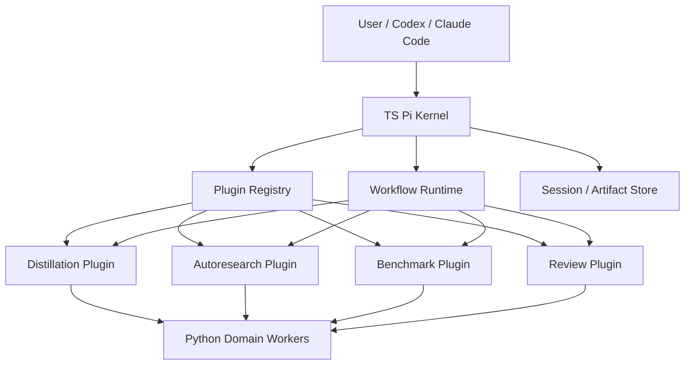

# 下一代架构：插件与工作流模型

## 文档目标

本文只定义下一代架构中的 `Pi Kernel / Plugin / Workflow` 部分，不覆盖数据源与执行适配器的细节实现。对应的适配器方案见 [data-and-execution-adapters.md](./data-and-execution-adapters.md)。

本文要解决四个核心问题：

1. 以 `TS Pi kernel` 作为系统核心时，哪些能力属于内核，哪些能力必须外移。
2. `distillation`、`autoresearch`、`review`、`benchmark` 如何作为技术上独立的插件存在。
3. 为什么业务上这些插件又必须能够按 workflow 组合调用，而不是完全孤立运行。
4. 如何把工作拆给多个开发小组并行推进，而不互相阻塞。

## 决策摘要

下一代架构采用：

- `TS Pi kernel` 作为智能体内核与工作流调度中心
- `Python domain workers` 作为领域能力实现层
- `distillation / autoresearch / review / benchmark` 作为一等插件
- `workflow` 作为插件的编排层，而不是把业务逻辑硬编码在某一个插件内部

一句话定义：

> 技术上，插件必须独立发布、独立测试、独立替换；业务上，插件必须通过 workflow 形成有序组合，完成蒸馏、优化、对标、复查和晋升判断。

## 核心原则

### 1. 内核稳定，插件可演化

`Pi kernel` 负责稳定的运行时语义：

- agent session
- tool / event bus
- workflow scheduling
- state persistence
- plugin registry
- workspace / identity / permissions

内核不负责：

- 钱包蒸馏逻辑本身
- autoresearch 迭代策略
- review 打分规则
- benchmark 业务指标
- AVE / OKX 等具体外部平台细节

### 2. 技术独立不等于业务孤立

下面这件事必须区分清楚：

- `技术独立`
  - 插件自己的代码、测试、版本、发布节奏独立
  - 插件可以被单独替换或停用
- `业务组合`
  - `autoresearch` 不会单独闭环
  - 它必须结合 `benchmark` 和 `review` 才能形成可信的优化循环

因此：

- 插件是独立交付单元
- workflow 是业务组合单元

### 3. 插件只表达能力，不表达最终控制权

插件可以：

- 读取 session 输入
- 生成 artifact
- 产出建议
- 请求后续步骤

插件不可以：

- 直接激活 skill
- 直接改 promoted state
- 绕过 review / benchmark / gate
- 直接写线上执行状态

最终治理权属于 kernel 的 workflow runtime 与 approval flow。

## 分层模型



## 目标职责边界

### TS Pi Kernel

负责：

- 插件发现、加载、版本校验
- workflow 定义解析
- work item 调度
- 插件之间的事件流转
- session / artifact / lineage 持久化
- team mode 角色分配
- 对 Codex / Claude Code 的 adapter 和 handoff

不负责：

- 具体的 distill 计算
- benchmark 回测实现
- review 业务评分
- 领域 provider / executor 细节

### Python Domain Workers

负责：

- 钱包蒸馏与特征提取
- 现有反思、技能编译、上下文构建
- benchmark 业务计算
- review 辅助特征与评分支撑
- 访问现有数据源与执行层的第一代适配实现

不负责：

- 插件生命周期
- workflow 编排
- agent team orchestration

### Plugins

负责表达“能力单元”，不是表达全系统闭环。

## 一等插件定义

### 1. Distillation Plugin

职责：

- 接收目标钱包、链、上下文约束
- 调用领域 worker 完成钱包风格蒸馏
- 产出结构化 skill seed
- 输出后续研究可用的 baseline artifact

输入：

- wallet / chain
- workspace config
- data adapter selection
- optional operator hints

输出：

- distilled profile
- strategy spec
- execution intent draft
- seed skill package
- distillation report

### 2. Autoresearch Plugin

职责：

- 围绕 baseline skill 生成候选变体
- 管理迭代预算、变体搜索和置信度
- 触发 benchmark 与 review
- 汇总阶段性结论

输入：

- baseline skill
- search space
- optimization objective
- iteration budget

输出：

- candidate variants
- iteration summary
- recommendation proposal

关键点：

- `autoresearch` 本身不应内嵌 benchmark 和 review 的全部逻辑
- 它应该通过 workflow 调度去调用 `benchmark` 与 `review`

### 3. Benchmark Plugin

职责：

- 对指定 variant 执行标准化验证
- 产生可比较的 scorecard
- 运行 hard gates
- 输出 benchmark artifacts

输入：

- variant
- benchmark profile
- test horizon / scenario set
- required adapters

输出：

- scorecard
- gate result
- benchmark artifact bundle

### 4. Review Plugin

职责：

- 对 baseline 与 candidate 进行对标复查
- 检查 style drift、风险偏移、解释一致性
- 输出 keep / discard / review_required / recommend 建议

输入：

- baseline artifact
- candidate artifact
- benchmark result
- review policy

输出：

- review decision
- review notes
- escalation / retry suggestion

## 插件生命周期契约

每个插件必须实现同一组运行时接口，便于 kernel 管理与替换。

建议契约：

```ts
interface WorkflowPlugin {
  pluginId: string
  pluginVersion: string
  pluginType: "distillation" | "autoresearch" | "benchmark" | "review"
  supportedSubjects: string[]
  inputSchemaVersion: string
  outputSchemaVersion: string
  capabilities(): PluginCapabilities
  plan(input: PluginPlanInput): Promise<PluginPlan>
  execute(input: PluginExecuteInput): Promise<PluginExecuteResult>
  validate(output: PluginExecuteResult): Promise<PluginValidationResult>
  summarize(state: PluginRuntimeState): Promise<PluginSummary>
}
```

最小语义要求：

- `plan`
  - 说明本次运行需要什么输入、资源和下游步骤
- `execute`
  - 真正执行业务逻辑
- `validate`
  - 检查产物格式、关键字段、hard gate 预条件
- `summarize`
  - 为 workflow 汇总可读输出

## Workflow 不是插件的别名

必须避免把“workflow”写进某个插件内部变成黑箱。

### Workflow 的职责

- 选择哪些插件参加一次任务
- 决定步骤顺序和依赖关系
- 管理失败重试和状态恢复
- 决定什么情况下进入人工审批

### Plugin 的职责

- 在 workflow 分配的边界内完成某个能力
- 输出结构化结果
- 不跨边界接管全局流程

## 标准业务组合

### A. 单次蒸馏工作流

```text
distillation -> review(optional) -> publish_seed
```

适用场景：

- 首次从钱包生成 skill
- 产出可研究的 baseline

### B. 自主研究工作流

```text
distillation(optional baseline refresh)
-> autoresearch
-> benchmark
-> review
-> autoresearch(next iteration or stop)
-> recommendation
```

这是未来的主力组合模式。

关键含义：

- `autoresearch` 发起研究循环
- `benchmark` 给出标准化对比
- `review` 给出复查和风险判断
- workflow 决定是否继续下一轮

### C. 审批前收敛工作流

```text
best candidate
-> benchmark(final profile)
-> review(final review)
-> approval package
```

适用场景：

- 形成可交付 recommendation
- 提交人类审批

## 推荐状态机

建议统一以下状态：

- `draft`
- `planned`
- `running`
- `benchmarking`
- `reviewing`
- `review_required`
- `recommended`
- `approved`
- `activated`
- `archived`

注意：

- `recommended` 可以自动产生
- `approved` 与 `activated` 必须保留人工控制

## 运行时对象

建议在 kernel 层固定以下对象：

- `WorkflowSession`
- `PluginInvocation`
- `VariantArtifact`
- `BenchmarkArtifact`
- `ReviewArtifact`
- `RecommendationBundle`
- `ApprovalRecord`

这些对象的 schema 由 kernel 持有，插件只能读写受控字段。

## 与 agent team 的关系

`planner / optimizer / reviewer` 这类 team role 不应直接等同于插件。

更合理的映射是：

- `planner role`
  - 定义 workflow 目标、约束、停止条件
- `optimizer role`
  - 主要驱动 `autoresearch plugin`
- `reviewer role`
  - 读取 `benchmark + review plugin` 产物并给出治理建议

也就是说：

- `role` 是协作视角
- `plugin` 是能力视角
- `workflow` 是组合视角

三者不能混写在一起。

## 团队并行开发拆分

### 小组 A：Kernel Runtime 组

负责：

- plugin registry
- workflow runtime
- session / artifact store
- plugin loading / versioning
- event bus / state machine

交付物：

- kernel plugin SDK
- workflow runtime skeleton
- runtime state schema

### 小组 B：Plugin SDK 与规范组

负责：

- plugin manifest 规范
- input/output schema 规范
- validation contract
- plugin test harness

交付物：

- `plugin manifest` 规范
- plugin contract 文档
- 插件模板仓或脚手架

### 小组 C：Distillation Plugin 组

负责：

- 把现有 distillation 逻辑包装成 plugin
- 产出 baseline skill seed
- 定义 distillation artifacts

交付物：

- `distillation plugin`
- baseline artifact schema

### 小组 D：Autoresearch Workflow 组

负责：

- autoresearch plugin
- iteration budget / variant generation
- confidence / stop condition
- recommendation 汇总

交付物：

- `autoresearch plugin`
- 自主研究 workflow v1

### 小组 E：Benchmark + Review 组

负责：

- benchmark plugin
- review plugin
- scorecard schema
- hard gate / style drift / risk gate

交付物：

- `benchmark plugin`
- `review plugin`
- review / benchmark policy profiles

### 小组 F：Agent Team Bridge 组

负责：

- Codex / Claude Code handoff
- team role 到 workflow session 的映射
- work item dispatch

交付物：

- team bridge runtime
- role handoff templates

## 迭代路线

### Phase 1：先立边界

目标：

- kernel / plugin / workflow 三层彻底分开
- 现有 Python 逻辑先不重写，只做包装

必须完成：

- kernel plugin contract
- distillation plugin v1
- benchmark / review plugin v1
- autoresearch workflow v1

### Phase 2：接入 team mode

目标：

- 让多 agent 以 workflow 为中心协作，而不是直接互相调用脚本

必须完成：

- planner / optimizer / reviewer 到 workflow steps 的映射
- artifact-based handoff
- session 恢复与审计

### Phase 3：提高替换性

目标：

- 插件和 worker 可独立演进
- 不依赖固定数据源或固定执行平台

依赖项：

- 数据源 adapter
- 执行 adapter
- worker RPC 边界稳定

## 非目标

当前阶段不做：

- 把所有 Python 代码一次性重写成 TS
- 让任何插件直接上线执行
- 让 autoresearch 绕过 review / benchmark 自动闭环到 live execution

## 验收标准

满足以下条件时，说明插件与工作流模型成立：

1. `distillation`、`autoresearch`、`benchmark`、`review` 都可以单独运行、单独测试、单独发布。
2. `autoresearch` 可以在不内嵌 benchmark/review 实现的情况下，联合它们形成研究循环。
3. workflow runtime 可以替换某个插件实现而不影响其他插件的接口。
4. team mode 通过 workflow 组合插件，而不是直接耦合到底层 Python 服务。
5. 任何 `recommended` 结果都必须能追溯到 distill、benchmark、review artifact。
