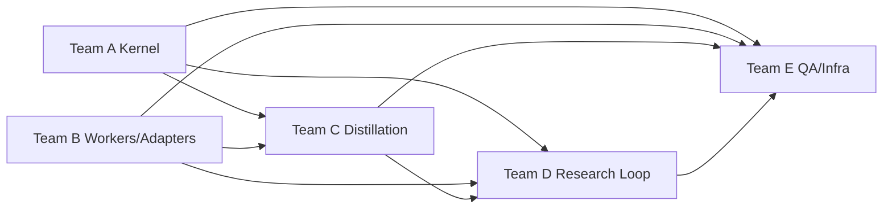

# 下一阶段架构团队交付方案

本文只覆盖团队分工、并行执行、里程碑协同与交付治理。迁移阶段定义见：[migration-phases.md](./migration-phases.md)。

目标是让开发团队能够并行推进 **`TS Pi Kernel + Python Domain Workers`** 迁移，不把不同工作流、不同适配器、不同基础设施任务混成一条串行大链。

## 1. 交付总原则

- 以工作流边界拆团队，不以语言简单拆团队。
- `TS Kernel`、`Python Workers`、`Adapters`、`Plugins`、`QA/Infra` 分成独立工作流。
- `distillation`、`autoresearch`、`review`、`benchmark` 虽然是不同插件，但共享统一契约与状态模型。
- `review` 与 `benchmark` 作为公共验证能力建设，不附属于任何单一插件团队。
- `0t team` 长期保留为多 agent/operator facade，但不再拥有独立状态机；所有 session/work-item/recommendation/approval 只以 kernel state 为准。
- 所有团队都围绕统一里程碑交付，不允许各自定义“完成”。

## 2. 推荐团队拓扑

## Team A：Kernel / Runtime Team

### 负责范围

- TS Pi kernel runtime
- workflow registry
- plugin lifecycle
- session / work item / journal / audit state
- worker bridge 协议

### 不负责

- 具体蒸馏算法
- benchmark 评分细节
- provider / execution 业务实现

## Team B：Domain Worker & Adapter Team

### 负责范围

- Python domain workers
- `DataSourceAdapter SPI`
- `ExecutionAdapter SPI`
- `AVEAdapter`
- `OnchainOSExecutionAdapter`
- 后续新 adapter 模板

### 不负责

- Pi kernel 内部调度
- 插件编排策略

## Team C：Distillation Plugin Team

### 负责范围

- `distillation plugin`
- 蒸馏输入/输出 schema
- distillation artifact contract
- 与 domain worker 的调用协议

### 不负责

- benchmark 打分规则
- review 决策逻辑

## Team D：Research Loop Team

### 负责范围

- `autoresearch plugin`
- `review plugin`
- `benchmark plugin`
- 研究循环的编排模板
- leaderboard / recommendation 语义

### 不负责

- kernel runtime
- 具体 data/execution adapter

## Team E：QA / Infra / Release Team

### 负责范围

- 迁移期间 CI / smoke / regression
- session replay fixtures
- 可观测性、审计、日志
- Docker / host 开发体验
- cutover 与 release governance

### 不负责

- kernel 业务语义设计
- 具体插件实现

## 3. 团队间依赖



### 依赖解释

- Team A 先提供 kernel contract，C/D 才能稳定接入。
- Team B 先提供 worker bridge 和 adapter SPI，C/D 才能避免直接绑 AVE/OKX。
- Team C 输出 baseline artifact contract，Team D 才能在 autoresearch 循环中复用 benchmark/review。
- Team E 必须从第一周就嵌入，不能在最后补 QA。

## 4. 并行执行策略

## Wave 0：边界冻结周

所有团队共同完成：

- 名词表
- 对象模型
- plugin manifest 草案
- adapter SPI 草案
- 兼容命令与回滚策略

输出后立即冻结第一版接口。

## Wave 1：平台与适配器并行

并行项：

- Team A：实现 kernel 最小骨架、registry、session 状态模型
- Team B：实现 data/execution SPI 与第一版 AVE/OKX adapter
- Team E：建立基线回归与迁移 smoke tests

串行依赖最小化原则：

- Team A 和 Team B 只共享 schema，不互等实现细节
- Team E 用 contract fixtures 而不是等待所有功能完工

## Wave 2：插件双线并行

并行项：

- Team C：distillation plugin
- Team D：benchmark + review plugin
- Team A：完善 plugin lifecycle、event bus、work item orchestration
- Team B：补 worker bridge 和插件侧调用 SDK

说明：

- `benchmark` 与 `review` 应先于 `autoresearch` 稳定，因为它们是循环中的公共能力。

## Wave 3：研究闭环成形

并行项：

- Team D：接入 autoresearch plugin，联动 benchmark/review
- Team C：保证 distillation baseline artifact 可直接喂入 autoresearch
- Team A：补 session replay、resume、handoff
- Team E：建立闭环回归

目标闭环：

```text
distillation -> benchmark baseline -> autoresearch pass -> review -> benchmark re-check -> recommendation
```

## Wave 4：兼容切换与发布

并行项：

- Team A：新旧入口切换与兼容层
- Team B：适配器稳定性和回退
- Team C / D：插件默认路由切换
- Team E：灰度验证、回滚演练、交付清单

## 5. 里程碑拆分

## Milestone A：接口冻结

### 目标

让所有团队对关键边界形成稳定共同理解。

### 依赖

- 当前系统术语梳理完成

### 交付

- plugin manifest v1
- worker bridge schema v1
- data/execution adapter SPI v1
- session / artifact / journal schema v1

### 验收

- 所有团队都能按冻结接口开始开发
- 无阻塞性架构争议未决

## Milestone B：平台最小可用

### 目标

让 kernel 和 adapter 层先可运行，插件团队开始接线。

### 依赖

- Milestone A 完成

### 交付

- kernel 最小 runtime
- AVE / OKX adapter v1
- 迁移 smoke tests v1

### 验收

- kernel 能创建 session 并调用 Python worker
- 适配器能在新 SPI 下复用现有主链能力

## Milestone C：插件可装配

### 目标

让四类插件都能按统一协议被注册和调用。

### 依赖

- Milestone B 完成

### 交付

- distillation plugin v1
- benchmark plugin v1
- review plugin v1
- plugin registry 可运行

### 验收

- 三个插件可各自执行最小任务
- 不修改 kernel 核心代码即可新增或替换插件

## Milestone D：研究闭环可运行

### 目标

让 autoresearch 能联合 benchmark/review 形成最小完整循环。

### 依赖

- Milestone C 完成

### 交付

- autoresearch plugin v1
- 研究闭环 workflow
- leaderboard / recommendation / review state

### 验收

- 可完整执行至少一轮 `plan -> variant -> benchmark -> review -> decide`
- session 可暂停、恢复、回放

## Milestone E：默认路径切换

### 目标

让新架构成为默认推荐路径，但保留兼容回退。

### 依赖

- Milestone D 完成

### 交付

- 新默认入口
- 兼容壳
- 迁移手册
- 灰度与回滚脚本

### 验收

- 现有 operator 命令仍可工作
- 新路径是文档和团队内部默认路径

## 6. 每个团队的详细工作包

## Team A：Kernel / Runtime

### 工作包

1. 设计 kernel runtime core
2. 定义 plugin lifecycle 和 plugin registry
3. 定义 worker bridge 协议
4. 统一 session / work item / event / artifact / journal schema
5. 提供 team orchestration 与 plugin dispatch

### 关键依赖

- 需要 Team B 提供 worker capability metadata
- 需要 Team C/D 提供 plugin manifest 的实际使用反馈

### 完成标准

- plugin 可注册、可发现、可执行、可审计
- session 可恢复、可回放、可观测

## Team B：Workers / Adapters

### 工作包

1. 设计 data source SPI
2. 设计 execution SPI
3. 接入 AVE adapter
4. 接入 OKX/OnchainOS adapter
5. 提供给 plugin 的 Python worker SDK

### 关键依赖

- 需要 Team A 的 worker bridge contract
- 需要 Team C/D 明确字段级输入输出

### 完成标准

- 插件层只调用 adapter / worker SDK
- 不再直接 import 具体 provider 模块

## Team C：Distillation Plugin

### 工作包

1. 设计 distillation plugin manifest
2. 标准化 distillation input / output
3. 对接 baseline benchmark 需求
4. 输出可供 autoresearch 复用的 baseline artifact

### 关键依赖

- 需要 Team B 提供 data worker / adapter
- 需要 Team A 提供 plugin lifecycle

### 完成标准

- distillation 输出物稳定、可复用、可审计
- 不依赖特定 workflow 的私有字段

## Team D：Research Loop

### 工作包

1. benchmark plugin
2. review plugin
3. autoresearch plugin
4. leaderboard / recommendation 策略
5. research loop workflow 模板

### 关键依赖

- 需要 Team C 的 baseline artifact contract
- 需要 Team B 的 worker SDK
- 需要 Team A 的 session / event / handoff 语义

### 完成标准

- benchmark 与 review 可独立复跑
- autoresearch 可联合 benchmark/review 完整闭环

## Team E：QA / Infra / Release

### 工作包

1. 建立迁移 regression baseline
2. 建立 plugin integration fixtures
3. 建立 session replay / recovery 测试
4. 建立灰度、回滚、发布检查表
5. 建立可观测性和故障演练

### 关键依赖

- 需要 A/B/C/D 输出最小 fixture 和契约

### 完成标准

- 每个里程碑都有自动化回归入口
- 切换前有可执行回滚方案

## 7. 并行开发中的接口纪律

### 7.1 允许冻结的接口

- plugin manifest
- session schema
- artifact schema
- data source adapter SPI
- execution adapter SPI
- worker bridge protocol

### 7.2 不允许各自扩展的接口

- reviewer 私有扩展 benchmark 输出字段
- distillation 私有扩展 autoresearch 必填字段
- adapter 私有注入 plugin 才能理解的隐式配置

### 7.3 变更机制

- 所有冻结接口按版本号管理
- 破坏性改动必须先经架构评审
- 里程碑之间才允许提升 major 版本

## 8. 交付节奏建议

## 周会节奏

- 每周一次 cross-team architecture sync
- 每周两次 workstream standup
- 每个里程碑结束前一次 integration review

## 看板建议

使用五条主泳道：

- Kernel
- Workers & Adapters
- Distillation
- Research Loop
- QA / Release

每条泳道再分：

- `contract`
- `implementation`
- `integration`
- `verification`

## 9. 风险与应对

### 风险 1：Team A 成为瓶颈

应对：

- 先冻结最小 contract，再持续演进实现
- 不让插件团队等“完美 kernel”

### 风险 2：benchmark/review 被做成 autoresearch 私有能力

应对：

- benchmark/review 独立建包、独立测试、独立验收
- 把它们定义为公共插件而非内部模块

### 风险 3：adapter 又被业务绕过

应对：

- 新插件禁止直接依赖 AVE/OKX 实现
- 代码评审以 SPI 合规性为硬门槛

### 风险 4：新旧入口长期双轨失控

应对：

- 在 Milestone E 前明确默认路径
- 旧路径只保留兼容，不承载新增能力

### 风险 5：团队只交功能，不交回归与运维

应对：

- 每个工作包都必须带验收测试和运行说明
- Team E 对交付完整性拥有否决权

## 10. 交付完成定义

只有同时满足以下条件，迁移项目才算交付完成：

- 新架构下的默认工作流可运行
- 数据源和执行层都经过 SPI 调用
- `distillation / autoresearch / review / benchmark` 四类插件都已协议化
- `autoresearch + review + benchmark` 闭环可稳定复现
- operator 仍可通过兼容入口完成核心操作
- 回归、灰度、回滚、审计、文档都齐备

## 11. 建议的人员配置

适合 `6-10` 人团队：

- Team A：2 人
- Team B：2 人
- Team C：1-2 人
- Team D：2 人
- Team E：1-2 人

如果人数更少，优先合并为三组：

- `Kernel + Infra`
- `Workers + Adapters`
- `Plugins + Research Loop`

但即便合并，也不要合并接口 ownership。
