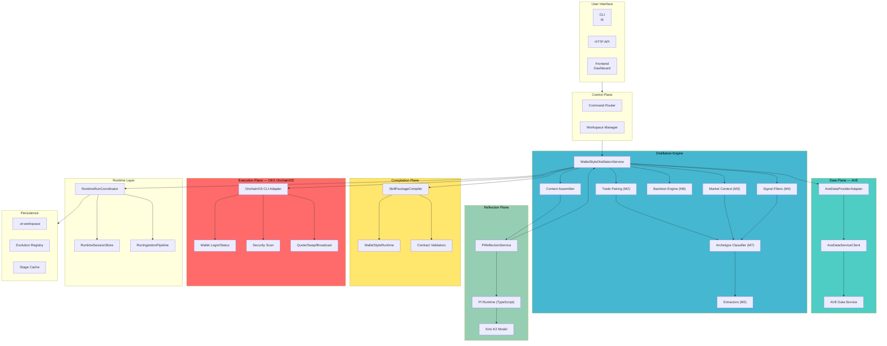
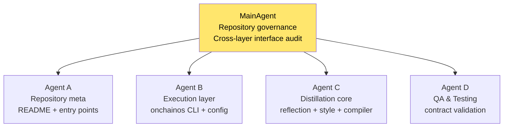
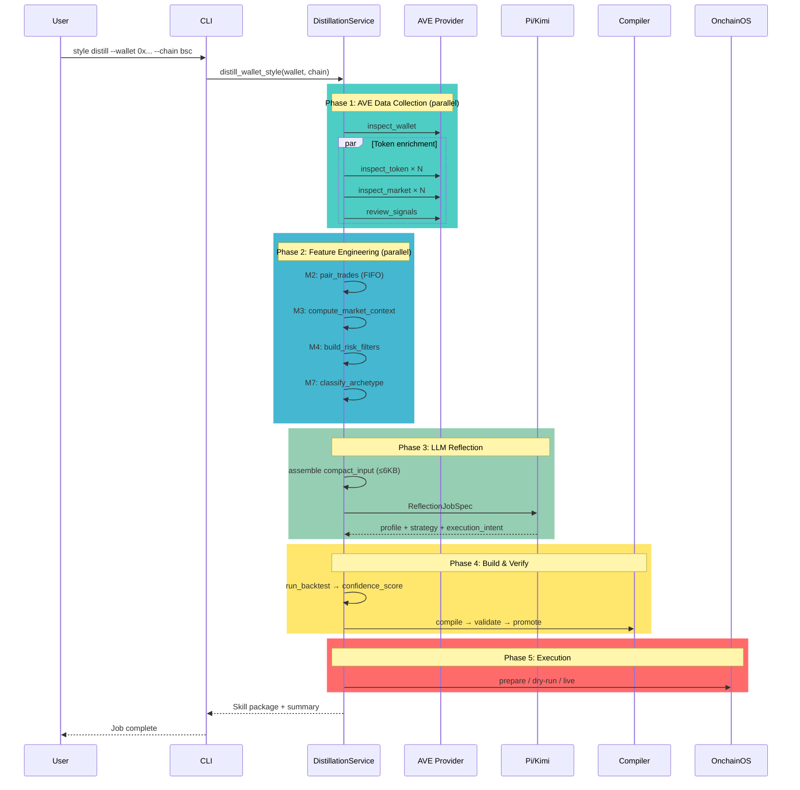
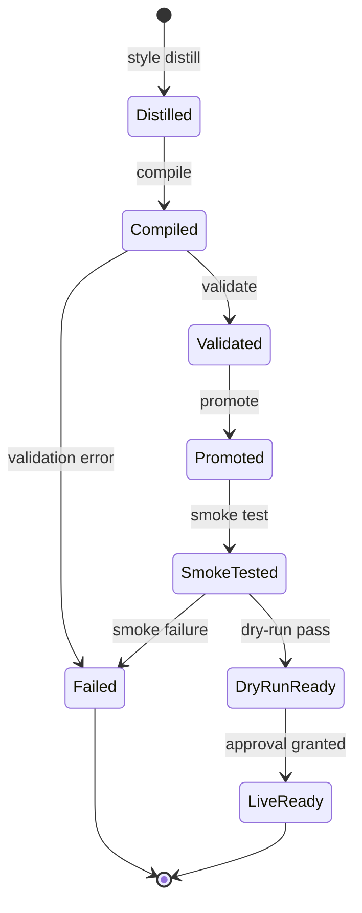
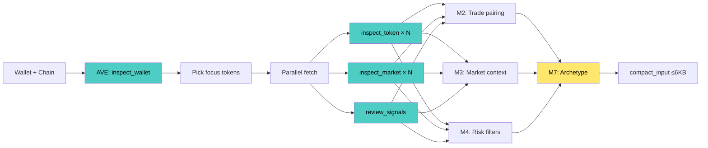
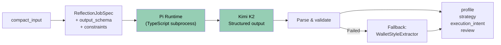
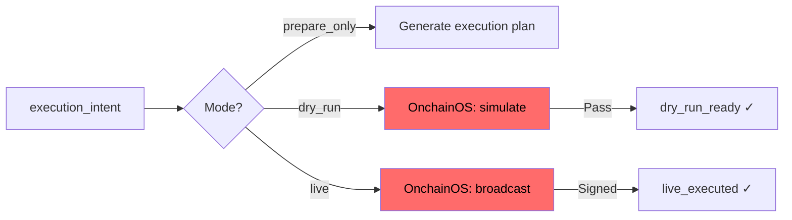
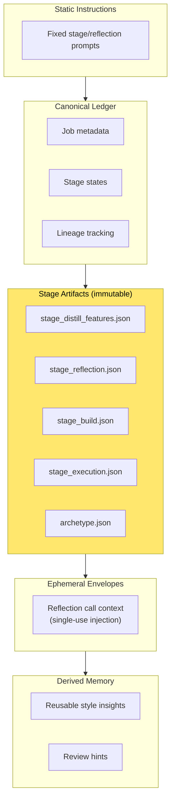

# 0T-Skill System Architecture

## High-Level Architecture

## Four-Plane Design

The system enforces strict separation between four operational planes:

```mermaid
flowchart LR
    subgraph DP["🟢 Data Plane<br/>AVE ONLY"]
        D1["Wallet profiles"]
        D2["Token details + risk"]
        D3["Market candles"]
        D4["On-chain signals"]
    end

    subgraph RP["🔵 Reflection Plane<br/>Pi/Kimi"]
        R1["Structured reasoning"]
        R2["Style profile generation"]
        R3["Strategy specification"]
    end

    subgraph CP["🟡 Compilation Plane<br/>Skill-OS"]
        C1["Package compilation"]
        C2["Contract validation"]
        C3["Registry promotion"]
    end

    subgraph XP["🔴 Execution Plane<br/>OKX OnchainOS"]
        X1["Wallet auth"]
        X2["Security scan"]
        X3["Simulate / Broadcast"]
    end

    DP -->|"compact_input ≤6KB"| RP
    RP -->|"profile+strategy"| CP
    CP -->|"execution_intent"| XP

    style DP fill:#4ECDC4,color:#000
    style RP fill:#96CEB4,color:#000
    style CP fill:#FFE66D,color:#000
    style XP fill:#FF6B6B,color:#000
```

**Isolation rules:**
- Data Plane (AVE) never executes trades
- Execution Plane (OnchainOS) never provides distillation data
- No cross-plane data backfeed — OnchainOS market/signal/PnL data is never injected into distillation

## Agent Framework

### Agent Hierarchy

### WalletStyleDistillationService — Core Orchestrator

### Candidate Lifecycle

## Four-Stage Pipeline Detail

### Stage 1: `distill_features`

**Output**: `stage_distill_features.json` + archetype artifact

### Stage 2: `reflection_report`

**Three-tier degradation**: Mock → Live Pi/Kimi → Rule-based fallback

### Stage 3: `skill_build`

**Output**: Complete Skill package directory + backtest results + confidence score

### Stage 4: `execution_outcome`

## Parallel Execution Strategy

```mermaid
gantt
    title Distillation Pipeline Timeline
    dateFormat X
    axisFormat %Ls

    section M1 Data (AVE)
    inspect_wallet           :m1a, 0, 3
    inspect_token × 4        :m1b, 3, 8
    inspect_market × 4       :m1c, 3, 8
    review_signals           :m1d, 3, 6

    section M2-M4 (parallel)
    Trade pairing            :m2, 8, 9
    Market context           :m3, 8, 9
    Risk filters             :m4, 8, 9

    section M7 Archetype
    classify_archetype       :m7, 9, 10

    section M5 LLM
    Pi/Kimi reflection       :m5, 10, 18

    section M6 Build
    Backtest + compile       :m6, 18, 20
```

**Critical path**: M1(8s) → M2-M4 parallel(1s) → M7(1s) → M5 LLM(8s) → M6(2s) = **~20s total**

## Context Layer Architecture

## Technology Decisions

| Decision | Choice | Rationale |
|---|---|---|
| Parallelism | `ThreadPoolExecutor` | AVE provider uses blocking subprocess; asyncio cannot accelerate |
| Market data for LLM | Pre-computed summaries | Raw K-lines too large (16KB+), would explode context |
| compact_input limit | 6KB | Pi maxTokens=3000 output; input safety zone ~4000 tokens |
| Trade matching | FIFO | On-chain txs have natural time ordering; FIFO is most intuitive |
| Entry factor analysis | Frequency statistics | Sample size <20 makes regression statistically insignificant |
| Archetype classifier | Rule-based + threshold | Transparent, auditable, no black-box ML on small samples |
| Data boundary | AVE-only | Prevents dual-path data drift between distillation and execution |
| Execution adapter | OnchainOS CLI | Mature execution capability, cleanly decoupled from data plane |
