# Project Documentation — Description of AVE Skills Used

## Project Overview

**0T-Skill** is an on-chain wallet trading style distillation and autonomous execution system. Given any wallet address, it automatically analyzes historical trading behavior, distills it into a structured trading strategy, and packages it as an executable **Skill** that can run real trades through OKX OnchainOS.

**AVE is the exclusive data intelligence layer** powering the entire distillation pipeline. Without AVE, there is no data — and without data, there is no distillation.

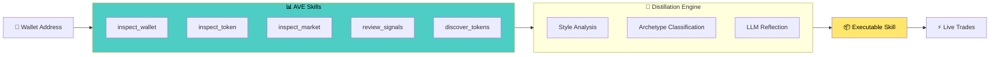

---

## AVE Skills Used

### 1. `inspect_wallet`

**Purpose**: The entry point for every distillation job. Retrieves the complete wallet profile including holdings, balance, and full transaction history.

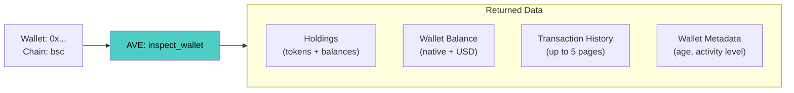

**How 0T-Skill uses it:**

| Data Field | Usage in Pipeline | Module |
|---|---|---|
| `holdings` | Extract Top-5 holdings by value; determine stablecoin bias | M1 |
| `activity` | Raw transaction history for FIFO trade pairing | M1 → M2 |
| `balance` | Calculate position sizing relative to total wallet value | M2 |
| `wallet_metadata` | Determine wallet age, activity frequency, session windows | M1 → M7 |

**Example call:**
```python
ave_provider.run("inspect_wallet", {
    "wallet": "0xbac453b9b7f53b35ac906b641925b2f5f2567a89",
    "chain": "bsc",
    "include_holdings": True,
    "include_activity": True
})
```

**Paginated history**: The system fetches up to 5 pages of transaction history to build a comprehensive behavioral profile while respecting AVE API rate limits.

---

### 2. `inspect_token`

**Purpose**: Enriches each focus token with detailed metadata, holder distribution, and smart contract risk assessment.

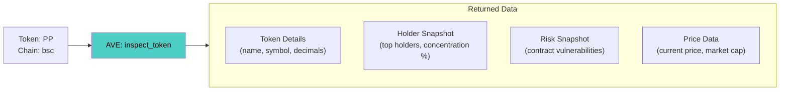

**How 0T-Skill uses it:**

| Data Field | Usage in Pipeline | Module |
|---|---|---|
| `holder_snapshot` | Detect holder concentration (e.g., "top holders control 95% of supply") | M4 Risk Filter |
| `risk_snapshot` | Identify contract risks (owner transfer control, slippage manipulation) | M4 Risk Filter |
| `price_data` | Enrich trade pairing with USD values; calculate PnL | M2 |
| `market_cap` | Classify small-cap bias for archetype detection | M7 Archetype |

**Parallel execution**: For each wallet, 0T-Skill selects the top focus tokens (typically 4) and calls `inspect_token` in parallel using `ThreadPoolExecutor`:

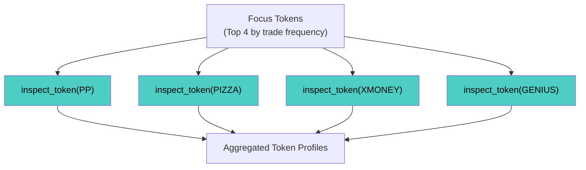

**Risk filter generation from AVE data:**

Real example from distilled Skill (`meme-hunter-bsc-567a89`):
- `BLOCK: PP can restrict transfers or freeze holders` — from `inspect_token` risk scan
- `WARN: PIZZA top holders control 95.47% of supply` — from `inspect_token` holder snapshot
- `WARN: 哔哔大队 has owner-controlled transfer rules` — from `inspect_token` AI report

---

### 3. `inspect_market`

**Purpose**: Provides market microstructure data including K-line candles, liquidity depth, and trading volume.

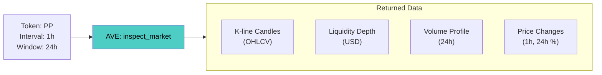

**How 0T-Skill uses it:**

| Data Field | Usage in Pipeline | Module |
|---|---|---|
| Price change % (1h, 24h) | Calculate momentum labels (bullish/bearish/neutral) | M3 Market Context |
| Volume data | Compute volume-to-liquidity ratio for entry factor analysis | M4 Entry Factors |
| Liquidity depth | Verify sufficient liquidity before trade execution | M4 → Execution |
| K-line data | Pre-compute volatility regime (low/medium/high/extreme) | M3 Market Context |

**Two-layer processing of market data:**

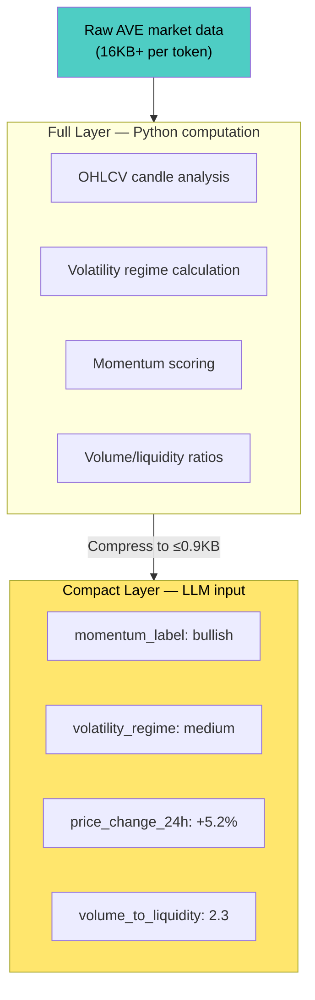

---

### 4. `review_signals`

**Purpose**: Detects on-chain anomaly signals including whale movements, unusual trading activity, and market alerts.

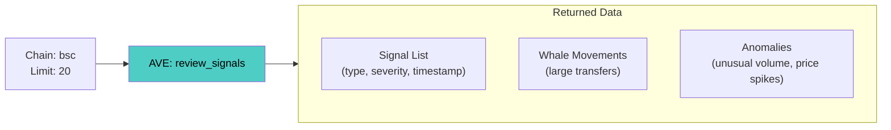

**How 0T-Skill uses it:**

| Data Field | Usage in Pipeline | Module |
|---|---|---|
| Signal list | Count active signals; filter by severity | M4 Signal Filter |
| High-severity signals | Generate anti-pattern warnings in Skill output | M4 → Skill Package |
| Signal context | Inject into compact_input for LLM awareness | M5 LLM Input |

---

### 5. `discover_tokens`

**Purpose**: Token search and discovery utility used for resolving token references during enrichment.

**How 0T-Skill uses it:**
- Auxiliary role: resolves ambiguous token identifiers during the enrichment phase
- Helps map raw transaction addresses to named tokens with metadata

---

## AVE Data Flow Through the Pipeline

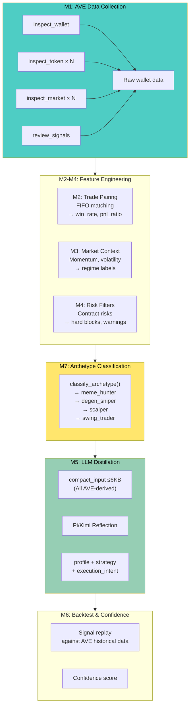

### AVE Data Budget for LLM

All data sent to the LLM originates from AVE. The system compresses raw AVE responses into a compact format:

| Section | Source AVE Endpoint | Budget |
|---|---|---|
| `wallet_summary` | `inspect_wallet` | 0.3 KB |
| `holdings` (Top 5) | `inspect_wallet` | 0.5 KB |
| `recent_activity` (Top 8) | `inspect_wallet` | 1.0 KB |
| `derived_stats` (M2) | `inspect_wallet` (tx history) | 0.5 KB |
| `market_context` | `inspect_market` | 0.9 KB |
| `signal_context` | `review_signals` + `inspect_token` | 0.5 KB |
| `archetype_context` | All endpoints (M7 aggregation) | 0.3 KB |
| `token_snapshots` (Top 4) | `inspect_token` | 0.6 KB |
| **Total** | | **≤6 KB** |

---

## Real Distilled Skill Examples Using AVE Data

### Example 1: Meme Hunter — `meme-hunter-bsc-567a89`

**What AVE data revealed:**

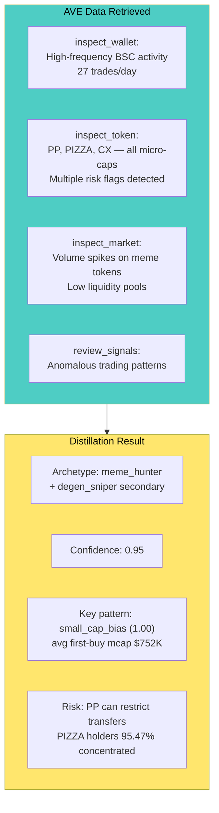

**AVE risk detection in action:**
- `inspect_token(PP)` → detected `owner_can_change_transfer_mode_after_initialization` → generated `BLOCK` level warning
- `inspect_token(PIZZA)` → detected top holder concentration at 95.47% → generated `WARN` level alert
- `inspect_token(哔哔大队)` → detected owner-controlled transfer rules → generated `WARN`

### Example 2: Exploratory Profile — `meme-hunter-bsc-c0bc2d`

**What AVE data revealed:**

- `inspect_wallet`: Lower frequency (3.44 trades/day), distributed across multiple tokens
- `inspect_token`: GENIUS, DiamondBalls, ASTER — mixed risk profiles
- Result: `no_stable_archetype` with 0.39 confidence — **the system honestly reports when AVE data doesn't support a confident classification**

This demonstrates that AVE data quality directly drives distillation confidence. Rich, consistent trading history yields high-confidence archetypes; sparse or contradictory data yields honest uncertainty.

---

## AVE as the Single Source of Truth

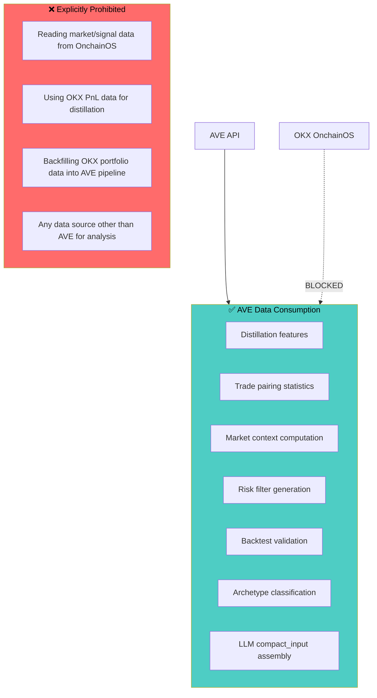

**Why AVE-only?**
1. **Data consistency**: Single source prevents metric drift between distillation and validation
2. **Auditability**: Every data point traces back to one provider with full artifact logging
3. **Reproducibility**: Same wallet + same AVE state = same distillation output
4. **Clean separation**: Data plane (AVE) and execution plane (OKX) have zero coupling

---

## Technical Implementation of AVE Integration

### AVE Data Provider Adapter

The `AveDataProviderAdapter` is the unified interface between 0T-Skill and AVE:

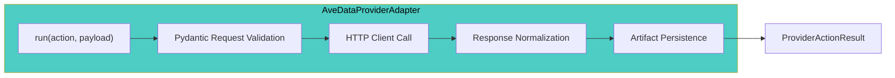

**Key design properties:**
- **Request validation**: Every AVE call goes through Pydantic model validation (`InspectWalletRequest`, `InspectTokenRequest`, etc.)
- **Response normalization**: All AVE responses are wrapped in a unified `ProviderActionResult` envelope with `ok`, `summary`, `response`, `error`, `artifacts`
- **Artifact persistence**: Every AVE call's request and response is saved as `{action}-{request_id}.json` for full traceability
- **Error classification**: HTTP errors, validation errors, and internal errors are categorized into standard error codes

### AVE Data Service

The AVE Data Service is a local HTTP server that proxies and normalizes AVE API calls:

| Endpoint | Maps to AVE Skill |
|---|---|
| `/v1/discover_tokens` | `discover_tokens` |
| `/v1/inspect_token` | `inspect_token` |
| `/v1/inspect_market` | `inspect_market` |
| `/v1/inspect_wallet` | `inspect_wallet` |
| `/v1/review_signals` | `review_signals` |

### AVE Cloud Skill Reference

The project vendors the official AVE Cloud Skill package (`vendor/ave_cloud_skill/`) which includes:
- `ave_data_rest.py` — REST API client implementation
- Reference documentation (data-api-doc, response-contract, token-conventions)
- Docker deployment configuration

---

## Summary

| AVE Skill | What It Provides | How 0T-Skill Uses It |
|---|---|---|
| `inspect_wallet` | Wallet profile, holdings, tx history | Entry point; trade pairing source; session window analysis |
| `inspect_token` | Token details, holder data, risk scan | Risk filtering; archetype small-cap detection; PnL enrichment |
| `inspect_market` | K-lines, liquidity, volume | Momentum/volatility context; entry factor volume analysis |
| `review_signals` | On-chain anomalies | Signal context for LLM; anti-pattern generation |
| `discover_tokens` | Token search/resolution | Auxiliary token identifier resolution |

AVE Skills are not just data endpoints — they are the **foundation of the entire distillation intelligence**. Every statistical feature, every archetype classification, every LLM insight, and every confidence score ultimately traces back to AVE data.
