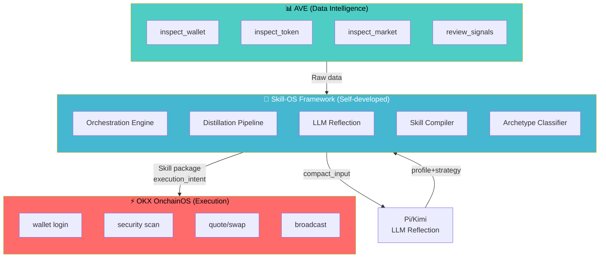
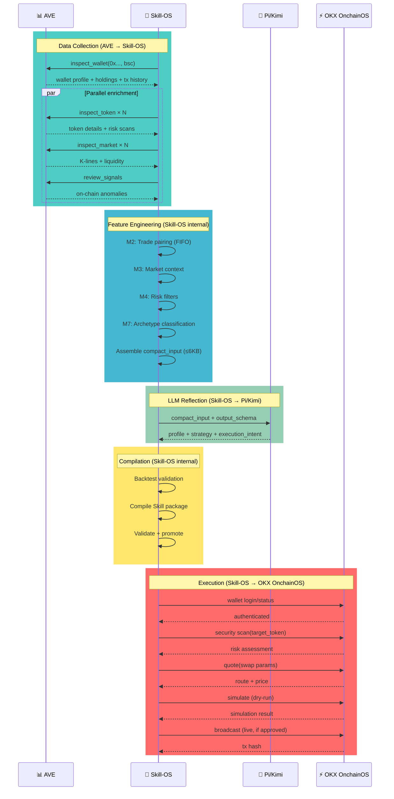
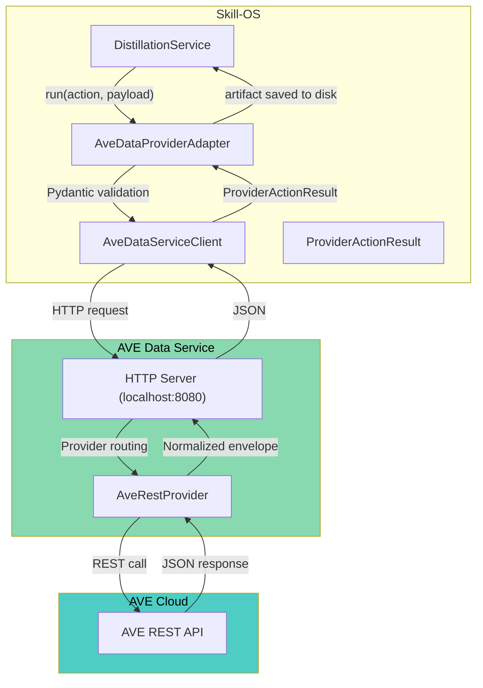
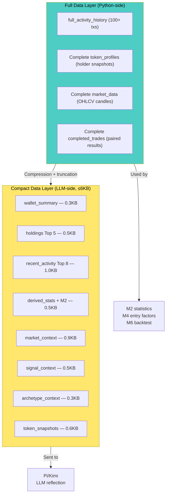
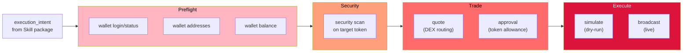
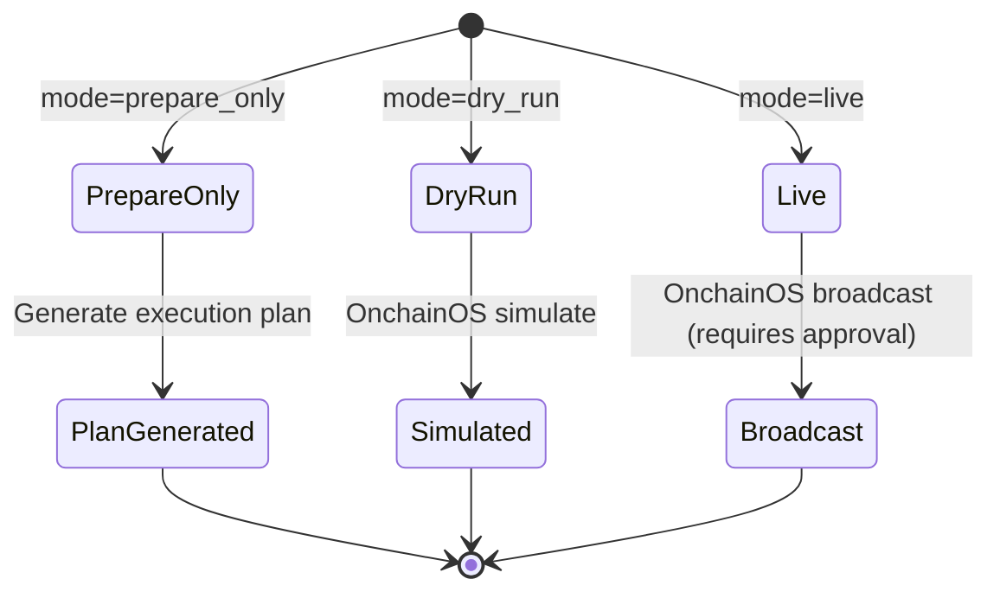
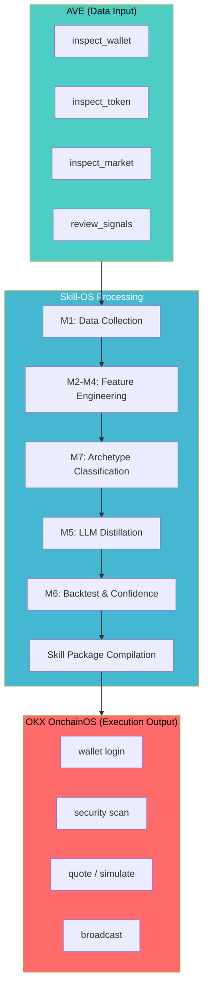
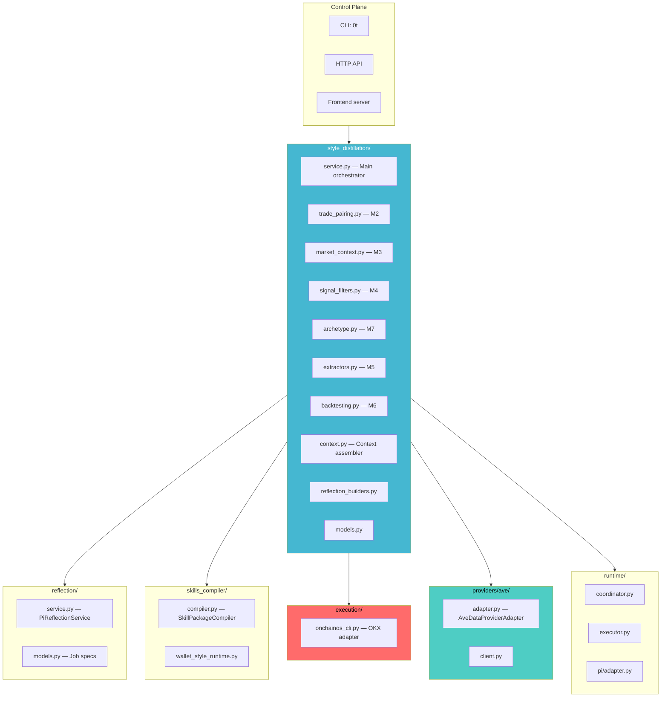
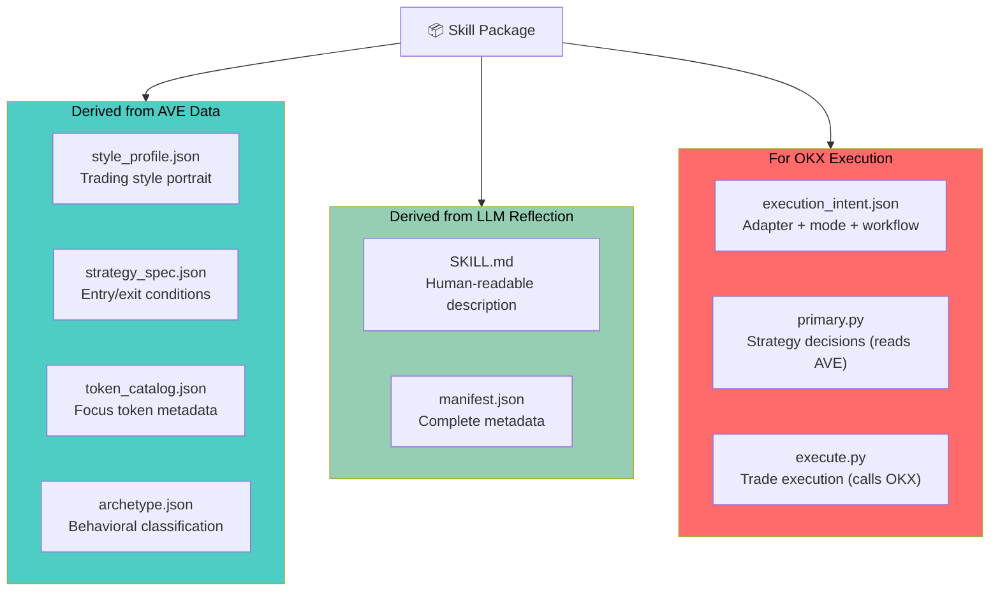

# AVE, OKX OnchainOS & Skill-OS Framework Integration

## Three-Component Relationship

**Metaphor:**
- **AVE** = the system's **eyes** — sees the on-chain world
- **Skill-OS** = the system's **brain** — analyzes, reasons, compiles
- **OKX OnchainOS** = the system's **hands** — executes real trades

## Data Flow Through All Three Components

## AVE Integration Detail

### Adapter Architecture

### Two-Layer Data Architecture

## OKX OnchainOS Integration Detail

### Execution Chain

### Execution Modes

### Security Constraints

| Constraint | Value | Source |
|---|---|---|
| Live execution approval | `requires_explicit_approval: true` | Always enforced |
| Single trade USD cap | `OT_ONCHAINOS_LIVE_CAP_USD` (default $10) | Environment variable |
| Minimum trade leg | `OT_ONCHAINOS_MIN_LEG_USD` (default $5) | Environment variable |
| Security scan | Mandatory preflight step | Hardcoded in execution chain |
| OKX credentials | `OKX_API_KEY`, `OKX_SECRET_KEY`, `OKX_PASSPHRASE` | Environment variables |

### Supported Chains

| Chain | Chain ID | Status |
|---|---|---|
| BSC | 56 | Verified |
| Ethereum | 1 | Supported |
| Base | 8453 | Supported |
| Polygon | 137 | Supported |
| Arbitrum | 42161 | Supported |
| Optimism | 10 | Supported |

## Skill-OS Framework — The Orchestration Brain

### How Skill-OS Bridges AVE and OKX

### Skill-OS Module Map

### Skill Package: Where AVE Data Meets OKX Execution

### Script Responsibility Split

| Script | Network Access | Data Source | Responsibility |
|---|---|---|---|
| `primary.py` | AVE only | AVE market data | Read real-time data, evaluate entry conditions, output trade plan |
| `execute.py` | OnchainOS only | OnchainOS CLI | Receive trade plan, execute security → quote → approve → swap |

This separation ensures **data judgment** and **trade execution** are decoupled — either side can iterate independently.

## Environment Variables Summary

### AVE Data Plane

| Variable | Purpose |
|---|---|
| `AVE_API_KEY` | AVE API authentication |
| `API_PLAN` | AVE API plan tier |
| `AVE_DATA_PROVIDER` | Provider identifier (default: `ave_rest`) |
| `AVE_DATA_SERVICE_URL` | AVE data service URL (default: localhost:8080) |

### OKX Execution Plane

| Variable | Purpose |
|---|---|
| `OKX_API_KEY` | OKX API key (required for live) |
| `OKX_SECRET_KEY` | OKX secret (required for live) |
| `OKX_PASSPHRASE` | OKX passphrase (required for live) |
| `OT_ONCHAINOS_LIVE_CAP_USD` | Max USD per trade (default $10) |

### LLM Reflection

| Variable | Purpose |
|---|---|
| `KIMI_API_KEY` | Kimi K2 model key |
| `OT_PI_REFLECTION_MODEL` | Model selection |
| `OT_PI_REFLECTION_MOCK` | Enable mock mode |
